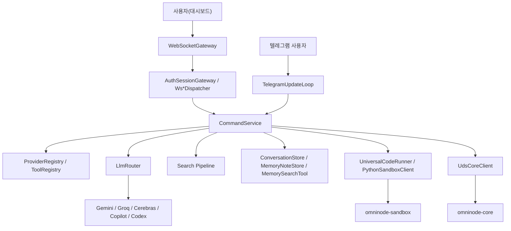

# Omni-node

업데이트 기준: 2026-03-08

Omni-node는 로컬 PC 제어, LLM 오케스트레이션, 코딩 자동 실행, 텔레그램 연동, 메모리 노트, 웹 검색 보강, 루틴 스케줄링을 한 저장소에 모아 둔 로컬 에이전트 프로젝트입니다.

이 저장소는 제품 소스만 있는 단일 애플리케이션 저장소가 아닙니다. 실제 런타임 소스, 운영 문서, 회귀 스크립트, 실험용 작업공간, 런타임 산출물까지 함께 들어 있습니다.

현재 canonical 레이아웃은 `apps/`, `docs/`, `workspace/` 3층입니다. 루트의 기존 `omninode-*`, `coding`, `runtime`, 문서 파일 경로는 하위 호환을 위한 심볼릭 링크로 유지합니다.

문서와 쉘 예시에서 기본 워크스페이스 경로는 항상 `/Users/songhabin/Omni-node/workspace/coding`으로 표기합니다. 기존 `coding` 경로는 하위 호환 alias로만 취급합니다.

## 한눈에 보기

- 실제 런타임 중심 모듈: `apps/omninode-core/`, `apps/omninode-middleware/`, `apps/omninode-dashboard/`, `apps/omninode-sandbox/`
- 작업공간/산출물: `workspace/coding/`, `workspace/.runtime/`, `workspace/runtime/`
- 설계/계획 문서: `docs/gemini-retriever-plan/`, `docs/*.md`
- 테스트 도구: Playwright, Node 기반 회귀 스크립트, GitHub Actions 워크플로

## 빠른 시작

권장 순서는 `코어 -> 미들웨어 -> 대시보드 접속`입니다.

```bash
make -C apps/omninode-core
./apps/omninode-core/omninode_core
```

다른 터미널에서:

```bash
dotnet run --project apps/omninode-middleware/OmniNode.Middleware.csproj
```

접속 주소:

- 대시보드: `http://127.0.0.1:8080/`
- WebSocket: `ws://127.0.0.1:8080/ws/`
- 헬스체크: `http://127.0.0.1:8080/healthz`
- 준비상태: `http://127.0.0.1:8080/readyz`

자세한 실행 절차는 [docs/사용법_빠른시작.md](docs/사용법_빠른시작.md)를 보세요.

## 문서 맵

### 이번에 정리한 canonical 문서

| 문서 | 내용 |
|---|---|
| [docs/사용법_빠른시작.md](docs/사용법_빠른시작.md) | 설치 전제조건, 실행 순서, 대시보드/텔레그램 사용 흐름 |
| [docs/기술스택_정리.md](docs/기술스택_정리.md) | 언어, 런타임, 외부 서비스, 테스트/배포 스택 정리 |
| [docs/아키텍처_흐름.md](docs/아키텍처_흐름.md) | 인증, 대화/코딩, 검색 가드, 루틴 실행 흐름 |
| [docs/디렉터리_가이드.md](docs/디렉터리_가이드.md) | 저장소 전체 디렉터리와 주요 파일 안내 |
| [docs/환경변수_및_상태파일.md](docs/환경변수_및_상태파일.md) | 주요 환경변수, 시크릿 로딩 방식, 상태 파일 위치 |
| [docs/CLEANUP.md](docs/CLEANUP.md) | 지워도 되는 것, 보존할 것, 1분 유지보수 체크리스트 |
| [docs/검증_가이드.md](docs/검증_가이드.md) | 빌드/스모크/회귀 검증 명령 모음 |

### 하위 호환 루트 링크

| 문서 | 내용 |
|---|---|
| [도구_통합_패널_사용_가이드.md](도구_통합_패널_사용_가이드.md) | `docs/도구_통합_패널_사용_가이드.md`로 연결되는 루트 링크 |
| [토큰_메모리_초기화_가이드.md](토큰_메모리_초기화_가이드.md) | `docs/토큰_메모리_초기화_가이드.md`로 연결되는 루트 링크 |
| [OMNINODE_실환경_수동_최종회귀_체크리스트.md](OMNINODE_실환경_수동_최종회귀_체크리스트.md) | `docs/OMNINODE_실환경_수동_최종회귀_체크리스트.md`로 연결되는 루트 링크 |
| [GEMINI_SEARCH_RETRIEVER_INTEGRATION_PLAN.md](GEMINI_SEARCH_RETRIEVER_INTEGRATION_PLAN.md) | `docs/GEMINI_SEARCH_RETRIEVER_INTEGRATION_PLAN.md`로 연결되는 루트 링크 |

## 시스템 개요



핵심 구조 요약:

- `apps/omninode-core`: UDS 소켓과 단일 인스턴스 락을 담당하는 얇은 C 데몬
- `apps/omninode-middleware`: 실질적인 본체. HTTP/WebSocket, LLM 라우팅, 메모리, 검색, 루틴, 텔레그램, 코딩 실행을 담당
- `apps/omninode-dashboard`: ES module 단위로 분리된 정적 React UMD 대시보드
- `apps/omninode-sandbox`: Python 코드 실행을 제한된 별도 프로세스로 수행

## 저장소 스냅샷

`.git` 및 하위 호환 심볼릭 링크 제외 기준 현재 워크스페이스에는 총 2,864개 실파일이 있습니다.

| 경로 | 파일 수 | 성격 |
|---|---:|---|
| `workspace/coding/` | 1,699 | 코딩 작업공간, 예제, 루틴 산출물, 가상환경 |
| `node_modules/` | 547 | Playwright 의존성 |
| `docs/gemini-retriever-plan/` | 303 | 검색 전환 계획 및 루프 자동화 기록 |
| `apps/omninode-middleware/` | 171 | .NET 9 미들웨어 소스와 체크 스크립트 |
| `workspace/.runtime/` | 71 | guard 회귀 아티팩트 |
| `apps/omninode-dashboard/` | 34 | 대시보드 UI와 체크 스크립트 |
| `apps/omninode-core/` | 3 | C 코어 데몬 |
| `deploy/` | 3 | systemd/launchd 템플릿 |
| `workspace/runtime/` | 2 | 현재 상태 스냅샷 |
| `apps/omninode-sandbox/` | 1 | Python 샌드박스 실행기 |

주의할 점:

- `workspace/coding/venv/`, `node_modules/`, `apps/omninode-middleware/bin/`, `apps/omninode-middleware/obj/` 같은 생성 산출물이 저장소 안에 있습니다.
- 루트 `package.json`은 앱 dev server 스크립트 저장소는 아니지만 `npm test` 통합 검증 엔트리를 제공합니다.
- 프런트엔드는 별도 dev server가 아니라 미들웨어가 정적 파일을 직접 서빙합니다.

## 위생 기준 요약

- 기준 경로는 `apps/`, `docs/`, `workspace/`이며, 기본 워크스페이스 예시는 항상 `/Users/songhabin/Omni-node/workspace/coding`입니다.
- 영속 상태 원본은 `~/.omninode`, 작업 산출물은 `workspace/`, 임시 실행 흔적은 `/tmp`, `workspace/.runtime`, `workspace/runtime`으로 구분해서 봅니다.
- 재생성 가능한 캐시는 과감히 청소해도 되지만, 상태 원본과 실행 이력은 보존 여부를 먼저 판단합니다.
- 청소 기준과 1분 유지보수 체크리스트는 [docs/CLEANUP.md](docs/CLEANUP.md)에 정리했습니다.

## 현재 구현 관점에서 중요한 포인트

- 자동 제공자 우선순위는 `gemini -> groq -> cerebras -> copilot -> codex` 순서입니다.
- 검색 경로의 기준 추상화는 특정 gateway 하나가 아니라 `grounding + guard + composer fallback`을 묶는 검색 파이프라인입니다. `LegacyGeminiGroundingSearchGateway`, `GeminiGroundedRetriever`, `ISearchAnswerComposer`, `search_cache_fallback`은 그 내부 구성 요소로 봐야 문서 해석이 가장 자연스럽습니다.
- 검색 응답은 `SearchAnswerGuard`의 fail-closed 정책을 통과해야 하며, 근거가 부족하면 답변이 차단됩니다.
- 대시보드는 OTP 기반 인증을 사용하고, 텔레그램이 미설정이면 로컬 OTP fallback 로그로도 인증할 수 있습니다.
- 루틴은 `~/.omninode/routines.json` 상태와 `workspace/coding/routines/` 실행 산출물을 함께 사용합니다.

## 대표 진입 파일

| 경로 | 역할 |
|---|---|
| `apps/omninode-core/src/main.c` | 단일 인스턴스 락과 UDS 서버 |
| `apps/omninode-middleware/src/Program.cs` | 전체 서비스 조립과 실행 진입점 |
| `apps/omninode-middleware/src/WebSocketGateway.cs` | WebSocket 수명주기와 dispatcher 조립 |
| `apps/omninode-middleware/src/AuthSessionGateway.cs` | OTP 요청, 인증, trusted auth 복구 |
| `apps/omninode-middleware/src/WsAiCommandDispatcher.cs` | 대화/코딩/명령 WS 분기 |
| `apps/omninode-middleware/src/CommandService.Chat.cs` | 대화 실행 진입과 응답 저장 |
| `apps/omninode-middleware/src/CommandService.SearchPipeline.cs` | 검색 의사결정과 grounded 검색 흐름 |
| `apps/omninode-dashboard/index.html` | 대시보드 HTML 진입점 |
| `apps/omninode-dashboard/app.js` | 대시보드 상태 조립 엔트리 |
| `apps/omninode-dashboard/modules/dashboard-settings-renderers.js` | 설정 패널 렌더러 |
| `apps/omninode-dashboard/worker.js` | 로그/WS 파싱 보조 워커 |
| `apps/omninode-sandbox/executor.py` | Python 샌드박스 실행기 |

## 이번 점검에서 확인한 대표 명령

2026-03-08 현재 아래 명령은 로컬에서 확인했습니다.

```bash
make -C apps/omninode-core
npm test
python3 apps/omninode-sandbox/executor.py --code "print('ok')"
```

권장 기억 순서는 `부팅 검증 -> 기본 건강검진 -> 실행기 검증`입니다. 보다 자세한 검증 항목은 [docs/검증_가이드.md](docs/검증_가이드.md)를 보세요.
