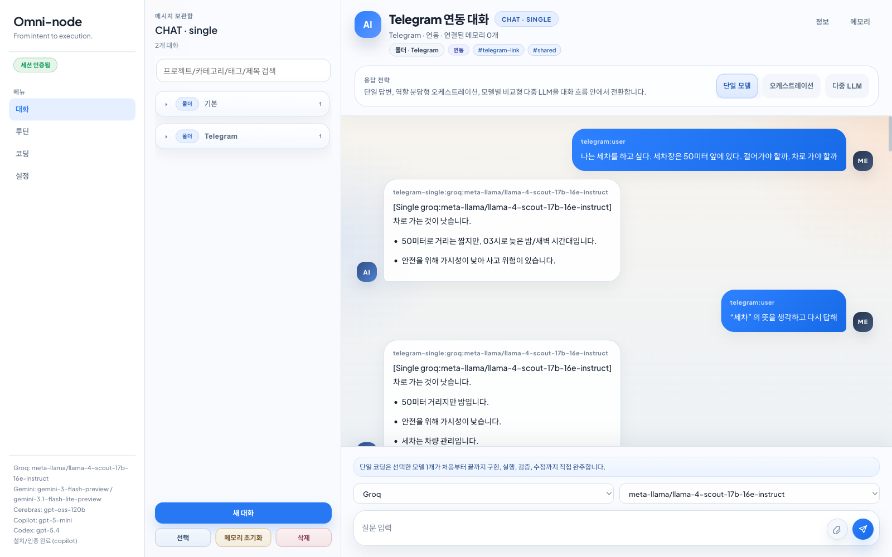
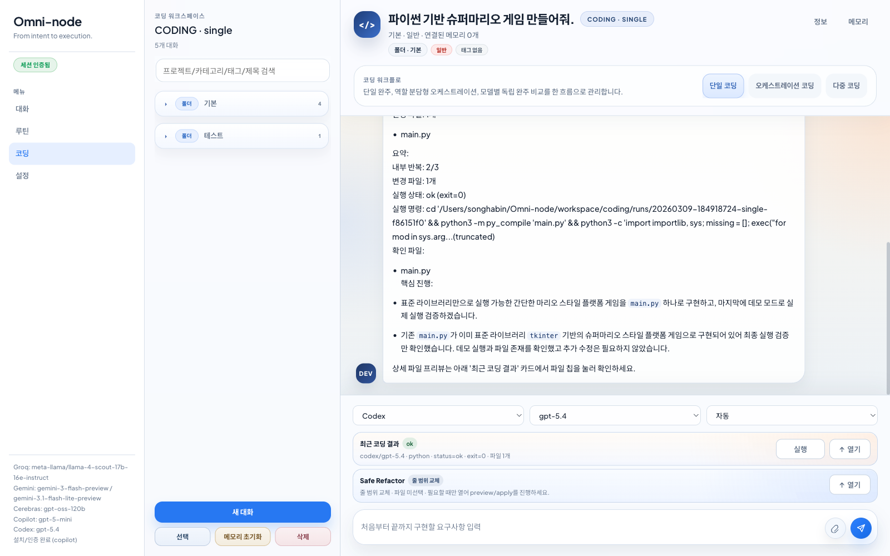
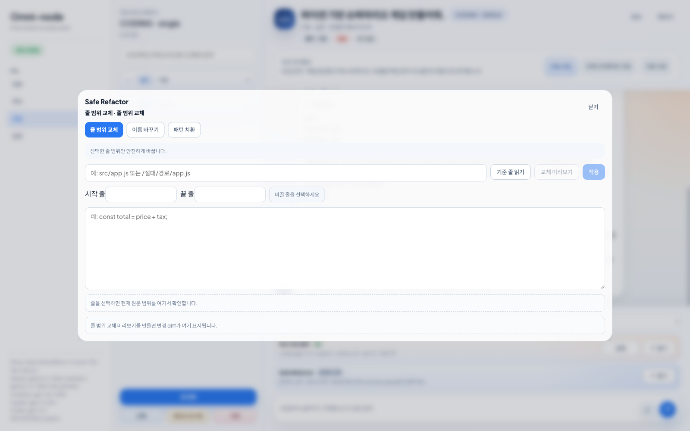
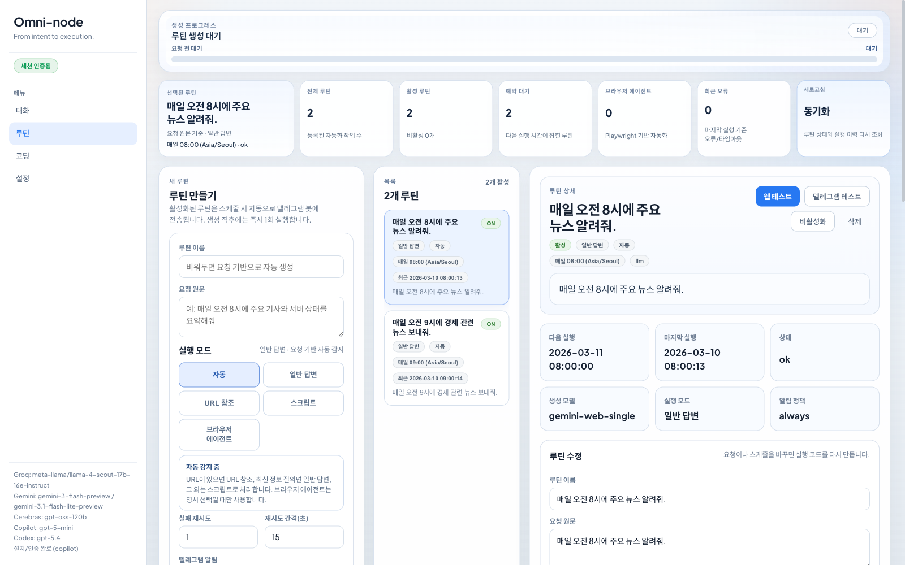
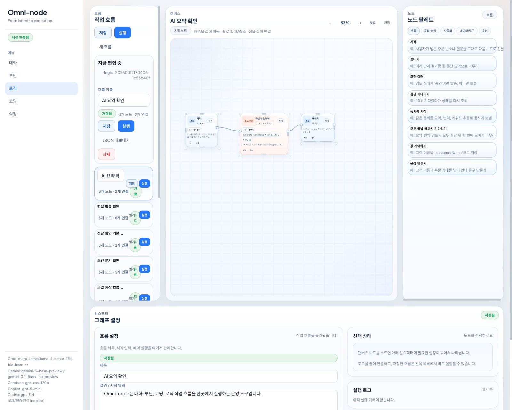
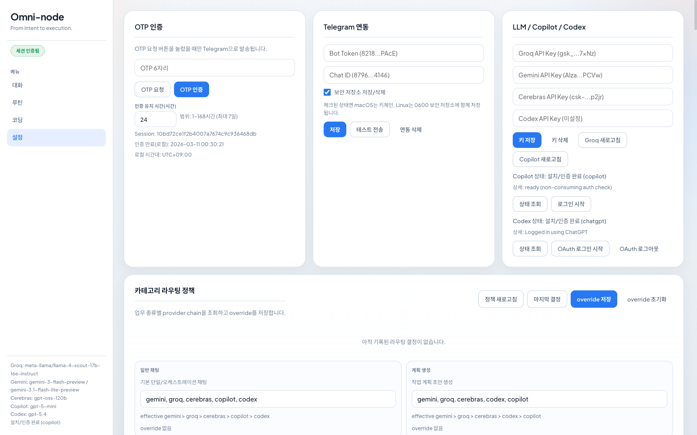
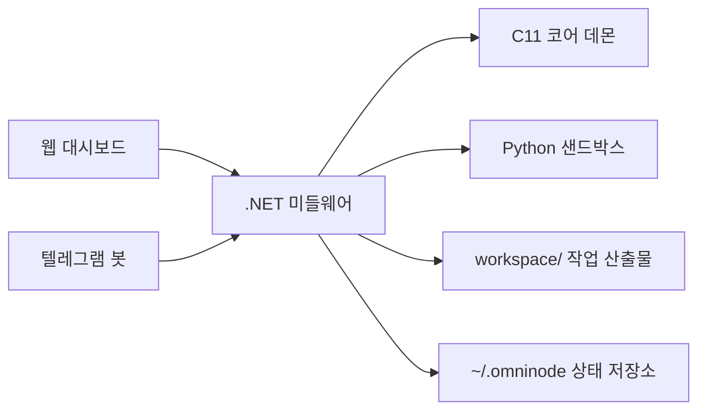

# Omni-node

<div align="center">

로컬 코어 데몬, .NET 미들웨어, 웹 대시보드, 샌드박스 실행기, 텔레그램 봇을 한 흐름으로 묶은 실전형 개발 워크벤치

[](./docs/아키텍처_흐름.md)
[](./apps/omninode-middleware)
[](./apps/omninode-dashboard)
[](./docs/사용법_빠른시작.md)
[](./docs/SAFE_REFACTORING.md)

</div>

업데이트 기준: 2026-03-13

## 소개

Omni-node는 아래 같은 과장된 분위기가 싫어서 시작한 프로젝트다.

> **"맥 미니를 사서 OpenClaw를 깔아야만 LLM을 제대로 쓸 수 있다"**
>
> **"맥 미니에 로컬 LLM만 올리면 다 된다"**
>
> **"무조건 Claude Opus 같은 최고가 모델만 써야 한다"**
>
> **"토큰 비용을 크게 태워야 결과가 나온다"**
>
> **"바이브 코딩은 결국 특정 최고가 모델로만 가능하다"**

비싼 장비, 고가 모델, 과한 비용 자랑보다 먼저 필요한 건
`지금 바로 굴릴 수 있는 실전 흐름`이라고 봤다.

그래서 이렇게 묶었다.

- `Groq`, `Cerebras`는 무료 API로 가볍게 시작
- `Gemini`는 무료 또는 낮은 비용 구간을 실용적으로 활용
- `Codex`, `Copilot`, 기존 ChatGPT 사용자 흐름도 자연스럽게 연결

그리고 이 프로젝트 자체도 말뿐인 "바이브 코딩" 이야기가 아니라,
실제로 계속 만들고 고치고 검증하면서 쌓아 올린 산출물이다.

즉흥적인 아이디어를 바로 구현으로 밀어 넣되, 결과물은 아래처럼 남게 만들었다.

- 실행 폴더
- 검증 로그
- 최근 코딩 결과
- 리팩터 preview

대화, 코딩, 루틴, Safe Refactor, 텔레그램 운영을 따로 놀게 두지 않고,
같은 상태 저장소와 같은 실행 파이프라인으로 묶었다.

질문만 잘 받아주는 데서 끝나는 게 아니라,
실제로 만들고, 실행하고, 검증하고, 다시 꺼내볼 수 있게 하는 쪽에 더 가깝다.

<table>
  <tr>
    <td bgcolor="#EAF4FF">
      <strong><font color="#315B7C">-결론-</font></strong><br><br>
      <h3><strong><font color="#1F3A5F">돈 많이 드는 장비나 비싼 모델 없어도, 바로 시작해서 써먹을 수 있게 만든 도구다.</font></strong></h3>
      <h3><strong><font color="#1F3A5F">말만 하는 AI가 아니라, 실제로 만들고 돌려 보고 확인한 결과까지 남길 수 있다.</font></strong></h3>
      <h3><strong><font color="#1F3A5F">웹에서 쓰든 텔레그램에서 쓰든, 같은 흐름으로 이어서 작업할 수 있다.</font></strong></h3>
    </td>
  </tr>
</table>

이 프로젝트를 만들면서 가장 먼저 정리하고 싶었던 건 이런 부분이었다.

- 답변은 남는데 실행 결과는 안 남는 문제
- 웹 대시보드와 텔레그램이 서로 다른 기능 집합으로 갈라지는 문제
- 코딩 결과물, 실행 명령, stdout/stderr, 검증 상태가 흩어지는 문제
- 리팩터링이 미리보기 없이 파일을 덮어쓰는 문제
- 예약 작업, 대화 문맥, 최근 코딩 결과가 연결되지 않는 문제

그래서 Omni-node는 이걸 다음 방식으로 정리한다.

- 웹과 텔레그램이 같은 명령 계층을 공유한다.
- 코딩 실행마다 별도 작업 폴더를 만든다.
- 최근 코딩 결과를 대화별로 복원한다.
- Safe Refactor는 `preview -> apply`와 stale-write 방지 검증을 거친다.
- `/readyz`, `doctor --json` 같은 운영 점검 경로를 기본 제공한다.

## 한눈에 보기

- `대화 탭`: 단일, 오케스트레이션, 다중 LLM 대화와 비교 흐름
- `코딩 탭`: 단일 완주, 역할 분담형 오케스트레이션, 모델별 독립 완주 비교
- `루틴 탭`: 스케줄 생성, 실행, 이력, 브라우저 에이전트, 텔레그램 전송
- `로직 탭`: ComfyUI 스타일 노드 캔버스로 대화/코딩/루틴/도구를 조합하고 저장/실행
- `Safe Refactor`: 줄 범위 교체, 이름 바꾸기, 패턴 치환
- `텔레그램`: 자연어로 대화/루틴/코딩/리팩터/계획/태스크/노트북 제어
- `운영`: health/ready/doctor, 상태 파일, 작업 산출물, 로그/검증 경로

현재 저장소 기준 핵심 구성은 다음과 같다.

- `apps/omninode-core`: C11 코어 데몬
- `apps/omninode-middleware`: .NET 9 미들웨어와 WebSocket/HTTP 게이트웨이
- `apps/omninode-dashboard`: 브라우저 대시보드
- `apps/omninode-sandbox`: Python 샌드박스 실행기
- `docs/`: 사용법, 상태 경로, 검증, 운영 문서
- `workspace/`: 실제 작업 산출물

## 스크린샷

### 대화 탭



단일 모델, 오케스트레이션, 다중 LLM 전략을 같은 대화 흐름 안에서 전환한다. 텔레그램 연동 대화도 웹에서 그대로 추적할 수 있다.

### 코딩 탭



단일 코딩, 오케스트레이션 코딩, 다중 코딩을 한 화면에서 관리한다. 실행 결과, 최근 코딩 결과, Safe Refactor 도크가 함께 붙는다.

### Safe Refactor



`줄 범위 교체`, `이름 바꾸기`, `패턴 치환` 모드를 미리보기 중심으로 적용한다. 오버레이 뒤에는 약한 blur가 걸리고, 적용 전에 다시 검증한다.

### 루틴 탭



루틴 생성, 상세 설정, 즉시 실행, 실행 이력, 텔레그램 전송 상태를 한 화면에서 확인한다.
브라우저 에이전트 루틴은 `시작 URL`, `에이전트 모델`, `도구 프로필(playwright_only|desktop_control)`까지 함께 설정한다.
루틴별 `텔레그램 봇 응답 켜기/끄기`를 지원하며, 생성 시 선택하거나 상세 패널에서 나중에 바로 바꿀 수 있다.

### 로직 탭



로직 탭은 `logic.graph.v1` 포맷의 그래프를 직접 편집하고 실행하는 전용 캔버스다. 데스크톱에서는 좌측 `1/4` 그래프 목록, 중앙 `2/4` 캔버스, 우측 `1/4` 노드 팔레트, 하단 인스펙터로 배치되고, 모바일 세로 레이아웃에서는 `목록 / 캔버스 / 팔레트 / 인스펙터` 섹션 탭으로 전환된다.

노드는 카드 전체를 바로 드래그해 배치할 수 있고, 배경 드래그로 팬, 휠로 줌, 출력 포트 점에서 입력 포트 점으로 드래그해서 연결한다. 리사이즈 핸들로 크기를 조절할 수 있고, 노드별 최소 크기가 적용돼 내용이 깨지지 않는다. 좌측 작업 흐름 목록과 우측 노드 팔레트는 패널 안에서 드래그 스크롤할 수 있다. 저장된 그래프를 다시 열었을 때 예전 뷰포트가 화면 밖으로 밀려난 경우에는 캔버스가 자동으로 맞춰져 노드가 바로 보인다. 인스펙터에서는 `직접 입력 / 목록에서 고르기 / 연결해서 받기` 방식으로 값을 넣고, 파일/메모리 경로는 `찾아보기`로 고를 수 있다. 저장된 그래프는 기존 루틴 저장소 안에 `logic_graph` 실행 모드로 보관되지만, 일반 루틴 탭 목록에는 섞이지 않는다.

### 설정 탭



제공자 키 관리, 텔레그램 설정, Codex/Copilot 상태, 라우팅 정책, 프로젝트 문맥, 계획/태스크/노트북/운영 패널을 모아 둔다.

## 왜 만들었나

LLM 쪽은 종종 너무 과하게 흘러간다.

- 비싼 장비가 없으면 시작도 못 하는 것처럼 말하거나
- 특정 최고가 모델만 써야 결과가 나온다고 몰아가거나
- 엄청난 토큰 비용을 태운 걸 실력처럼 포장하는 분위기가 있다

예를 들면 이런 식이다.

> "맥 미니 사서 OpenClaw 깔아야만 제대로 LLM을 쓸 수 있다"
>
> "맥 미니에 로컬 LLM만 올리면 충분하고, 그걸로 다 해결된다"
>
> "결국 Claude Opus 같은 최고가 모델만 써야 한다"
>
> "토큰 비용을 엄청 태워야 진짜 결과가 나온다"

Threads나 유튜브를 보다 보면 이런 식의 과장된 문법이 생각보다 흔하다.

- 실사용 팁보다 장비 자랑이 먼저 나오고
- 재현 가능한 워크플로보다 비싼 모델 영수증이 먼저 나오고
- 누구나 따라 할 수 있는 방법보다 "나만 아는 셋업"처럼 포장하는 경우가 많다
- 자칭 "바이브 코딩"이라면서 결국 특정 최고가 모델 찬양이나 과장된 자기 홍보로 흐르는 경우도 많다
- 로컬 LLM 이야기를 할 때도 실제 속도, 큰 모델 한계, 유지 비용은 빼고 만능 해법처럼 말하는 경우가 많다

Omni-node는 그런 분위기와 거리를 두고 싶어서 만든 도구이기도 하다.

좋은 도구라면 먼저 사람이 바로 써볼 수 있어야 한다.
하드웨어 자랑, 토큰 비용 자랑, 특정 모델 숭배가 앞에 나오면 결국 남는 건 과시뿐이고, 실제 작업 흐름은 빈약해지기 쉽다.

내가 생각하는 바이브 코딩은 모델 이름을 올려치고 분위기만 파는 게 아니다.
떠오른 요구사항을 바로 코드로 옮기고, 실제로 실행해 보고, 실패하면 고치고, 그 흔적이 산출물로 남는 쪽에 가깝다. Omni-node는 그 과정을 프로젝트 자체에 그대로 박아 넣으려 한 결과물이다.

Omni-node는 그 반대 방향으로 만들었다.

무조건 무거운 로컬 셋업이나 최고가 모델 하나에 기대지 않고, 실제로 손에 잡히는 조합을 우선한다.

- `Groq`, `Cerebras` 쪽은 무료 API로 바로 시작할 수 있고 초기 할당량도 꽤 넉넉해서, 빠른 응답이 필요할 때 부담 없이 붙이기 좋다.
- `Gemini`는 무료 또는 낮은 비용 구간을 최대한 실용적으로 쓴다.
- `Codex`, `Copilot`, 기존 ChatGPT 계열에 익숙한 사용자도 흐름을 크게 바꾸지 않고 들어올 수 있게 맞춘다.

핵심은 "비싸야 좋다"가 아니라 "지금 당장 계속 굴릴 수 있느냐"다.
Omni-node는 모델 과시보다 실제 작업 지속성과 운영 편의성을 우선한다.

## 왜 Omni-node인가

대부분의 AI 도구는 첫 답변까지는 그럴듯하다. 문제는 그 다음이다.

- 어떤 모델이 어떤 설정으로 실행됐는지 나중에 못 찾는다.
- 모델이 만든 파일과 실행 명령이 섞여 추적이 어렵다.
- 같은 기능이 웹에서는 되고 텔레그램에서는 안 된다.
- 리팩터링은 가능해 보이지만 실제로는 덮어쓰기 수준에 그친다.
- 스케줄 실행과 수동 대화가 서로 다른 기록 체계를 쓴다.

Omni-node는 이 지점을 운영 가능한 구조로 바꾼다.

| 문제 | Omni-node의 방식 |
| --- | --- |
| 채팅과 실행이 분리됨 | 대화와 코딩 결과를 같은 대화 기록에 묶음 |
| 결과 추적이 어려움 | 실행별 작업 폴더와 최근 결과 snapshot 저장 |
| 웹/텔레그램 기능 차이 | 같은 명령 계층과 자연어 제어 공유 |
| 리팩터 안전장치 부족 | preview 저장, 재검증, apply 차단 |
| 운영 상태 확인 어려움 | `healthz`, `readyz`, `doctor --json` 제공 |

## 핵심 기능 지도

### 1. 대화

- `단일 모델`: 선택한 모델 하나가 즉시 응답
- `오케스트레이션`: 워커 역할을 자동 분담해 초안, 점검, 보완, 최종 정리를 합성
- `다중 LLM`: 모델별 응답을 캐러셀로 넘겨 보며 아래 메시지에서 `공통 요약 / 공통 핵심 / 부분 차이` 확인
- 텔레그램 연동 대화, 메모리 노트 연결, URL 컨텍스트, grounded 검색 연동

### 2. 코딩

- `단일 코딩`: 선택한 모델 1개가 처음부터 끝까지 구현, 실행, 검증, 수정까지 직접 완주
- `오케스트레이션 코딩`: `기획 -> 개발 -> 검증 및 테스트 -> 수정` 단계를 자동 분담
- `다중 코딩`: 여러 제공자/모델이 독립 하위 폴더에서 완주하고 결과를 비교
- `최근 코딩 결과`: 대화별로 저장되어 새로고침 후에도 복원
- `실행 산출물`: `workspace/coding/runs/<timestamp>-<mode>-<suffix>/`

기본 코딩 모델은 현재 `Codex / gpt-5.4`다.

### 3. 루틴

- 자연어로 루틴 생성 및 수정
- 즉시 실행, 활성/비활성, 상세 확인, 실행 이력 조회
- `브라우저 에이전트` 실행 모드 지원
- 브라우저 에이전트는 가능하면 `시작 URL`을 함께 주는 방식이 가장 안정적이다
- 현재 브라우저 에이전트 모델은 `gpt-5.4`를 사용한다
- 도구 프로필은 `playwright_only`, `desktop_control` 두 가지다
- `desktop_control`은 macOS 전용이며, Playwright 우선 + 필요 시 데스크톱 제어를 추가로 사용하고 로그인/다운로드를 허용한다
- 브라우저 에이전트의 스크린샷과 다운로드 파일은 `workspace/coding/routines/<routine-id>/assets/<runTs>/` 아래에 저장된다
- 루틴별 `텔레그램 봇 응답` on/off를 지원하며 기본값은 `켜짐`이다
- 예약 실행 시 텔레그램 응답이 켜진 루틴만 자동 전송된다
- `텔레그램 테스트`, `실행 이력 재전송`은 응답 토글이 꺼져 있어도 명시적으로 다시 보낼 수 있다
- 웹 수동 실행 이력의 `telegram=not_applicable`는 실패가 아니라 전송 대상이 아님을 뜻함

### 4. 로직

- `logic.graph.v1`: `start/end`, 조건, 병렬 분기/합류, 대화/코딩/루틴/도구 노드를 DAG로 구성
- `캔버스 편집`: 노드 드래그, 배경 팬, 휠 줌, 포트 드래그 연결, 리사이즈 핸들, JSON import/export
- `레이아웃`: 데스크톱은 `그래프 목록 1/4 + 캔버스 2/4 + 노드 팔레트 1/4 + 하단 인스펙터`, 모바일은 `목록 / 캔버스 / 팔레트 / 인스펙터`
- `입력 방식`: `직접 입력 / 목록에서 고르기 / 연결해서 받기`, 파일·메모리 경로 브라우저, 문장 미리보기
- `저장 모델`: `~/.omninode/routines.json` 안의 `ExecutionMode=logic_graph`
- `런타임 산출물`: `workspace/.runtime/logic/<graph-id>/<run-id>/`
- `실행 기록`: `graph.json`, `snapshot.json`, `events.log`와 노드별 결과 envelope를 남김

### 5. Safe Refactor

- `줄 범위 교체`: 선택한 줄 범위만 안전하게 수정
- `이름 바꾸기`: LSP 기반 심볼 rename preview/apply
- `패턴 치환`: ast-grep 기반 구조적 치환 preview/apply
- 공통 흐름은 `읽기 -> 미리보기 -> 재검증 -> 적용`

### 6. 텔레그램

텔레그램은 보조 채널이 아니라 웹 대시보드 없이도 주요 기능을 직접 쓸 수 있는 운영 채널이다.

- 일반 대화
- 코딩 실행과 최근 결과 조회
- Safe Refactor read/preview/apply
- 루틴 생성, 수정, 이력 확인, 재전송
- `doctor`, `plan`, `task`, `notebook`, `handoff`, `memory`, `LLM 상태/모델 제어`

슬래시 명령 없이도 자연어로 제어할 수 있다.

예시:

- `단일 코딩으로 로그인 페이지 만들어줘`
- `최근 코딩 결과 보여줘`
- `리팩터 상태 보여줘`
- `내일 오전 9시에 서버 상태 점검 루틴 만들어줘`

### 7. 운영 패널

- 제공자 키 관리
- Codex / Copilot 상태 조회 및 로그인 연계
- 프로젝트 문맥 스캔
- 계획 생성/리뷰/승인/실행
- Background Task Graph
- Notebook / Handoff
- 최신 doctor 보고서 조회

## 시스템 구성



실제 코드 구조도 이 흐름을 그대로 따라간다.

- 미들웨어의 `CommandService.*` partial과 `Ws*Dispatcher`가 기능별 진입을 나눈다.
- 로직 그래프는 `WsLogicCommandDispatcher -> ILogicApplicationService -> CommandService.LogicGraphs.cs` 경로로 별도 진입한다.
- 대시보드는 `app.js`를 진입점으로 두고 `modules/`에 기능 로직을 분리한다.
- 작업 산출물은 `workspace/`, 영속 상태는 `~/.omninode`로 분리한다.

## 저장소 구조

```text
Omni-node/
├─ apps/
│  ├─ omninode-core/          # C11 코어 데몬
│  ├─ omninode-dashboard/     # 브라우저 대시보드
│  ├─ omninode-middleware/    # .NET 9 미들웨어
│  └─ omninode-sandbox/       # Python 샌드박스 실행기
├─ docs/                      # 사용법, 검증, 운영 문서
├─ workspace/                 # 코딩/루틴 산출물
├─ scripts/                   # 저장소 공통 스크립트
├─ package.json               # 웹 회귀 스크립트 진입
└─ README.md
```

현재 워크트리는 `.git` 제외 기준 3,818개 실파일로 구성되어 있고, 이 중 제품 구현의 중심은 `apps/omninode-core`, `apps/omninode-middleware`, `apps/omninode-dashboard`, `apps/omninode-sandbox` 네 영역이다. 대시보드 모듈 파일은 49개, 미들웨어 `Application/` 파일은 70개, `Infrastructure/` 파일은 17개다.

canonical 루트는 `apps/`, `docs/`, `workspace/`다. 루트 `coding`, `runtime`, `omninode-*` 경로는 하위 호환 alias로만 취급한다.

## 빠른 시작

### 1. 필수 도구

- `make`
- `.NET SDK 9`
- `node` + `npm`
- `python3`

권장:

- `sqlite3`
- `gh` + `copilot`
- `codex`

### 2. 원커맨드 시작

전역 명령이 등록된 상태라면 아래 세 개만 기억하면 된다.

```bash
Omni-node setup
Omni-node
Omni-node shutdown
```

- `Omni-node setup`: 의존성 확인, Homebrew 기반 설치, `npm ci`, 코어 빌드, .NET 빌드, 샌드박스 smoke, `npm test`, 전역 명령 등록까지 한 번에 수행
- `Omni-node`: 서버 시작. 미들웨어가 코어를 자동 부트스트랩하고 `http://127.0.0.1:8080/` 준비 상태까지 기다린 뒤 URL과 로그 경로를 출력
- `Omni-node shutdown`: CLI가 관리하는 미들웨어와 이 과정에서 새로 띄운 코어를 함께 종료

전역 명령이 아직 등록되지 않은 첫 실행이라면 저장소 안에서 한 번만 아래처럼 실행하면 된다.

```bash
./scripts/Omni-node setup
```

CLI 상태 파일은 `~/.omninode/cli/` 아래에 남는다.

### 3. 코어 빌드

```bash
make -C apps/omninode-core
```

수동 실행:

```bash
./apps/omninode-core/omninode_core
```

### 4. 미들웨어 실행

```bash
dotnet run --project apps/omninode-middleware/OmniNode.Middleware.csproj
```

기본 포트는 `8080`이다. 미들웨어는 필요하면 로컬 코어를 자동 부트스트랩하려 시도한다.

### 5. 대시보드 접속

- 대시보드: `http://127.0.0.1:8080/`
- 헬스체크: `http://127.0.0.1:8080/healthz`
- 준비상태: `http://127.0.0.1:8080/readyz`

`readyz`는 첫 WebSocket roundtrip이 잡혀야 올라간다. 현재 대시보드는 접속 직후 초기 `ping`을 자동 전송한다.

### 6. 운영 점검

```bash
curl -s http://127.0.0.1:8080/healthz
curl -s http://127.0.0.1:8080/readyz
dotnet run --project apps/omninode-middleware/OmniNode.Middleware.csproj -- doctor --json
```

### 7. 기본 검증

```bash
make -C apps/omninode-core
python3 apps/omninode-sandbox/executor.py --code "print('ok')"
dotnet build apps/omninode-middleware/OmniNode.Middleware.csproj
npm test
```

`npm test`는 저장소 루트 `scripts/run-omninode-tests.mjs`를 실행하며, 저장소 위생 게이트와 대시보드 WebSocket 서버 메시지 라우터 계약 검증까지 함께 확인한다.

## 설정과 시크릿

시크릿은 직접 환경변수보다 `*_FILE` 경로 방식을 권장한다. 예시 저장 경로는 `~/.omninode/keys`다.

```bash
mkdir -p "$HOME/.omninode/keys"

printf 'YOUR_GEMINI_KEY' > "$HOME/.omninode/keys/gemini_api_key"
printf 'YOUR_GROQ_KEY' > "$HOME/.omninode/keys/groq_api_key"
printf 'YOUR_CEREBRAS_KEY' > "$HOME/.omninode/keys/cerebras_api_key"
printf 'YOUR_TELEGRAM_BOT_TOKEN' > "$HOME/.omninode/keys/telegram_bot_token"
printf 'YOUR_TELEGRAM_CHAT_ID' > "$HOME/.omninode/keys/telegram_chat_id"
chmod 600 "$HOME/.omninode/keys/"*

export OMNINODE_GEMINI_API_KEY_FILE="$HOME/.omninode/keys/gemini_api_key"
export OMNINODE_GROQ_API_KEY_FILE="$HOME/.omninode/keys/groq_api_key"
export OMNINODE_CEREBRAS_API_KEY_FILE="$HOME/.omninode/keys/cerebras_api_key"
export OMNINODE_TELEGRAM_BOT_TOKEN_FILE="$HOME/.omninode/keys/telegram_bot_token"
export OMNINODE_TELEGRAM_CHAT_ID_FILE="$HOME/.omninode/keys/telegram_chat_id"
export OMNINODE_WORKSPACE_ROOT="/path/to/Omni-node/workspace/coding"
```

추가로 쓸 수 있는 제공자/경로:

- Gemini
- Groq
- Cerebras
- Copilot CLI
- Codex CLI 또는 Codex API Key

## 실제 사용 흐름

### 대화

1. 대화 탭에서 `단일 모델`, `오케스트레이션`, `다중 LLM` 중 하나 선택
2. 메시지 입력
3. 필요 시 웹 검색, URL 컨텍스트, 메모리 사용
4. 다중 LLM이면 모델별 결과를 캐러셀로 넘기고 공통점/차이 확인

### 코딩

1. 코딩 탭에서 `단일 코딩`, `오케스트레이션 코딩`, `다중 코딩` 중 하나 선택
2. 제공자/모델/언어를 고른 뒤 요구사항 입력
3. 실행 폴더 생성
4. 파일 생성 또는 수정
5. 실행과 검증
6. 실패 시 수정 패스 진행
7. 최근 코딩 결과 카드에 결과 보존

### 루틴

1. 루틴 탭에서 자연어로 루틴 생성
2. 브라우저 자동화가 필요하면 `실행 모드 -> 브라우저 에이전트`를 선택
3. `시작 URL`, `에이전트 모델`, `도구 프로필` 지정
4. 스케줄, 활성화 여부, `텔레그램 봇 응답 켜기/끄기`, 텔레그램 알림 정책 확인
5. 즉시 실행 또는 예약 실행
6. 실행 이력과 결과 확인

브라우저 에이전트 요청 예시:

- `로그인 후 주문 내역 CSV를 다운로드하고 파일명과 한 줄 요약을 알려줘`
- `상품 검색 후 첫 번째 상품 상세 페이지까지 들어가서 스크린샷을 저장해`
- `관리자 페이지에 로그인해서 오늘 주문 수를 확인하고 마지막에 요약해`

CLI/텔레그램에서는 예를 들어 이렇게 만들 수 있다.

```text
/routine create browser --model gpt-5.4 --url https://example.com --tool-profile desktop_control 로그인 후 CSV를 다운로드해서 요약해줘
```

### 로직

1. 로직 탭에서 새 그래프를 만들거나 저장된 그래프를 선택
2. 좌측 그래프 목록에서 그래프를 고르거나 이름을 바로 수정하고 저장/실행
3. 중앙 캔버스에서 노드 카드 전체를 드래그해 위치를 바꾸고, 배경 드래그로 팬, 휠로 줌, 리사이즈 핸들로 크기 조절
4. 우측 노드 팔레트에서 필요한 노드를 추가하고, 출력 포트 점에서 입력 포트 점으로 드래그해 연결 생성
5. 하단 인스펙터에서 그래프 메타데이터, 선택 노드 설정, 실행 로그를 확인하고, 필요하면 `직접 입력 / 목록에서 고르기 / 연결해서 받기`로 값을 채움
6. 저장 후 실행하거나 JSON을 복사/붙여넣기로 import/export

주의:

- 로직 그래프는 `logic_graph` 루틴으로 저장되지만 일반 루틴 탭 목록에는 나오지 않는다.
- 현재 로직 그래프 편집과 실행 제어는 웹 대시보드 경로가 기준이다.

### Safe Refactor

1. 코딩 탭 입력창 위의 `Safe Refactor` 도크 열기
2. `줄 범위 교체 / 이름 바꾸기 / 패턴 치환` 중 선택
3. 파일/심볼/패턴 입력
4. preview diff 확인
5. apply 직전 재검증 후 적용

## Safe Refactor 요약

Safe Refactor는 코드 편집을 바로 덮어쓰지 않게 만드는 안전 계층이다.

| 모드 | 의미 | 사용 예시 |
| --- | --- | --- |
| 줄 범위 교체 | 선택한 줄만 바꿈 | 특정 함수 본문 일부 수정 |
| 이름 바꾸기 | 심볼 rename | 함수명, 변수명, 메서드명 변경 |
| 패턴 치환 | 구조적 rewrite | `hello($A)`를 `hi($A)`로 치환 |

공통 원칙:

1. 먼저 preview를 만든다.
2. apply 전에 현재 파일 상태를 다시 확인한다.
3. 그 사이 파일이 바뀌었으면 적용을 막는다.

자세한 흐름은 [docs/SAFE_REFACTORING.md](./docs/SAFE_REFACTORING.md)를 본다.

## 상태와 산출물

Omni-node는 `상태 원본`과 `작업 산출물`을 분리한다.

| 위치 | 의미 |
| --- | --- |
| `~/.omninode` | 영속 상태 원본 |
| `workspace/` | 작업 산출물 루트 |
| `workspace/coding/runs/` | 코딩 실행별 작업 폴더 |
| `workspace/coding/routines/` | 루틴 실행 산출물과 브라우저 에이전트 자산 |
| `workspace/.runtime/logic/` | 로직 그래프 실행별 `graph.json`, `snapshot.json`, `events.log` |
| `workspace/.runtime/refactor-preview/` | Safe Refactor preview 저장 |
| `~/.omninode/cli/` | `Omni-node` 전역 실행기 PID, 로그, 최근 시작 메타데이터 |
| `/tmp/omninode_core.<uid>.sock` | 코어 UDS 소켓 |

이 구조 덕분에 아래를 다시 추적할 수 있다.

- 어떤 대화에서 어떤 코딩 결과가 나왔는지
- 실행 명령이 무엇이었는지
- stdout/stderr가 무엇이었는지
- refactor preview가 무엇이었는지
- 루틴 실행이 텔레그램으로 나갔는지
- 로직 그래프가 어떤 노드 상태로 끝났는지

`~/.omninode/routines.json`은 일반 루틴과 `logic_graph` 정의를 함께 저장하는 원본이다. 다만 대시보드 `루틴 탭`의 조회 경로는 `logic_graph` 항목을 필터링하고, `로직 탭`이 별도 API로 이들을 다룬다.

## 문서

- [사용법 빠른 시작](./docs/사용법_빠른시작.md)
- [아키텍처 흐름](./docs/아키텍처_흐름.md)
- [검증 가이드](./docs/검증_가이드.md)
- [환경변수 및 상태 파일](./docs/환경변수_및_상태파일.md)
- [Safe Refactoring](./docs/SAFE_REFACTORING.md)
- [Doctor](./docs/DOCTOR.md)
- [Planning / Tasks](./docs/PLANNING_AND_TASKS.md)
- [Notebook / Handoff](./docs/NOTEBOOKS_AND_HANDOFF.md)
- [AGENTS / Skills](./docs/AGENTS_AND_SKILLS.md)
- [기술 스택 정리](./docs/기술스택_정리.md)

## 운영 메모

- canonical 루트는 `apps/`, `docs/`, `workspace/`다.
- 코딩 결과를 보존하려면 `workspace/coding/runs/`를 정리 정책과 함께 관리해야 한다.
- 최근 코딩 결과 복원 상태까지 보존하려면 `~/.omninode/conversations.json`을 함께 보관해야 한다.
- 텔레그램 자연어 제어는 slash 명령보다 우선하지만, 정밀 제어가 필요할 때는 slash 명령도 그대로 사용할 수 있다.

## 한 줄 요약

Omni-node는 `대화`, `코딩`, `루틴`, `로직 그래프`, `리팩터`, `텔레그램 운영`을 하나의 로컬 실행 파이프라인으로 묶는 프로젝트다.
