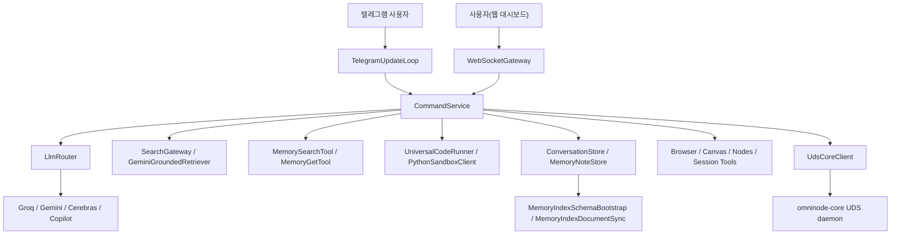

# Omni-node

마지막 정리 기준: 2026-03-06 로컬 워크스페이스 스냅샷

Omni-node는 로컬 PC 자원 제어, LLM 대화/오케스트레이션, 코딩 자동 실행, 텔레그램 봇, 메모리 노트, 웹 검색 보강, 루틴 스케줄링을 한 저장소에 모아 둔 로컬 에이전트 프로젝트다.  
현재 저장소는 제품 소스만 있는 깔끔한 형태가 아니라, 아래 성격이 한 저장소에 함께 들어 있다.

- 실제 런타임 소스: `omninode-core`, `omninode-middleware`, `omninode-dashboard`, `omninode-sandbox`
- 운영/설계 문서: 루트 문서들, `gemini-retriever-plan/`
- 회귀 자동화/검증 스크립트: `omninode-dashboard/check-*.js`, `omninode-middleware/check-*.js`
- 런타임 작업공간: `coding/`
- 자동 루프 기록과 회귀 산출물: `.runtime/`, `gemini-retriever-plan/loop-automation/runtime/`, `runtime/`
- 벤더/생성 산출물: `node_modules/`, `coding/venv/`, `omninode-middleware/bin/`, `omninode-middleware/obj/`

## 1. 저장소 스냅샷

`.git` 제외 기준으로 이 저장소에는 총 2,751개 파일이 있다. 그중 실제 제품 구현보다 벤더/생성 산출물 비중이 큰 편이다.

| 위치 | 파일 수 | 성격 |
|---|---:|---|
| `coding/` | 1,664 | 코딩 작업공간, 샘플 코드, 가상환경 |
| `node_modules/` | 547 | Playwright 의존성 |
| `gemini-retriever-plan/` | 303 | Gemini 검색 전환 계획, 루프 자동화 기록 |
| `omninode-middleware/` | 126 | .NET 9 미들웨어 소스, 체크 스크립트, 빌드 산출물 |
| `.runtime/` | 71 | guard 회귀 아티팩트 |
| `omninode-dashboard/` | 19 | 대시보드 UI 및 회귀 스크립트 |
| `omninode-core/` | 3 | C 기반 코어 데몬 |
| `deploy/` | 3 | Linux/macOS 서비스 템플릿 |
| `.github/` | 3 | GitHub Actions 워크플로와 Finder 메타 파일 |
| `runtime/` | 2 | 현재 상태 스냅샷 |
| `omninode-sandbox/` | 1 | Python 샌드박스 실행기 |
| 기타 루트 파일 | 나머지 | README, 패키지 메타, 운영 문서 등 |

실제 제품 구현의 중심은 아래 네 디렉터리다.

1. `omninode-core/`
2. `omninode-middleware/`
3. `omninode-dashboard/`
4. `omninode-sandbox/`

## 2. 시스템 개요

### 2.1 현재 스택

- 코어 데몬: C
- 미들웨어: C# / .NET 9 / AOT
- 웹 UI: 정적 HTML + React UMD + 순수 JS
- 텔레그램: Bot API 롱폴링
- 보조 실행기: Python 샌드박스 실행기
- 프런트 회귀 테스트: Playwright

### 2.2 런타임 흐름



### 2.3 구현 상태를 읽을 때 주의할 점

- 검색 경로는 Gemini grounding 단일 경로로 정리되어 있다.
- 검색 답변의 주 경로는 `LegacyGeminiGroundingSearchGateway` + `GeminiGroundedRetriever` + `SearchAnswerGuard` 조합이다.
- 저장소에는 빌드 산출물, 가상환경, `.DS_Store`, 루프 자동화 기록까지 커밋되어 있다.
- 따라서 이 README는 "깨끗한 제품 코드 저장소" 설명이 아니라 "현재 로컬 저장소 전체" 설명 문서다.

## 3. 빠른 실행

### 3.1 코어 실행

```bash
cd omninode-core
make
./omninode_core
```

### 3.2 미들웨어 실행

```bash
cd omninode-middleware
dotnet run --project OmniNode.Middleware.csproj
```

### 3.3 접속 주소

- 대시보드: `http://127.0.0.1:8080/`
- WebSocket: `ws://127.0.0.1:8080/ws/`
- 헬스체크: `http://127.0.0.1:8080/healthz`
- 준비상태: `http://127.0.0.1:8080/readyz`

### 3.4 별도 프런트엔드 개발 서버 여부

없다. `omninode-dashboard/`는 번들러 기반 앱이 아니라 정적 파일이며, 미들웨어가 직접 서빙한다.

## 4. 루트 파일 상세

| 경로 | 역할 |
|---|---|
| `README.md` | 이 저장소 전체 구조를 정리하는 총괄 문서 |
| `package.json` | Node 개발 의존성 선언. 현재 사실상 `playwright`만 사용 |
| `package-lock.json` | Node 잠금 파일. `playwright`, `playwright-core`, optional `fsevents` 포함 |
| `.gitignore` | 바이너리, `bin/`, `obj/`, 로그류, `.DS_Store` 무시 규칙 |
| `GEMINI_SEARCH_RETRIEVER_INTEGRATION_PLAN.md` | Gemini 검색 전용 리트리버 + 멀티 생성기 통합 설계서 |
| `OMNINODE_실환경_수동_최종회귀_체크리스트.md` | 실환경 수동 검증 체크리스트와 실제 관찰 코멘트 |
| `도구_통합_패널_사용_가이드.md` | 설정 탭 도구 통합 패널 사용법 |
| `토큰_메모리_초기화_가이드.md` | 토큰 설정값, 메모리 구조, 초기화 절차 |
| `.github/workflows/guard-alert-dispatch-regression.yml` | guard alert dispatch 회귀 워크플로 |
| `.github/workflows/guard-retry-timeline-browser-e2e-regression.yml` | retry timeline 브라우저 E2E 회귀 워크플로 |
| `.DS_Store`, `.github/.DS_Store`, `deploy/.DS_Store` 등 | macOS Finder 메타데이터 파일 |

## 5. `omninode-core/` 상세

`omninode-core/`는 매우 작지만, 프로세스 단일성 보장과 UDS 서버를 담당하는 가장 저수준 계층이다.

| 경로 | 역할 |
|---|---|
| `omninode-core/src/main.c` | 단일 인스턴스 락 파일(`/tmp/omninode.<uid>.lock`) 관리, UDS 서버(`/tmp/omninode_core.<uid>.sock`) 생성, 동일 UID peer 검증, 기본 JSON 필드 추출 유틸리티를 포함한 코어 데몬 |
| `omninode-core/Makefile` | `cc -std=c11 -Wall -Wextra -O2` 기반 빌드 및 실행 타깃 |
| `omninode-core/omninode_core` | 현재 저장소에 들어 있는 빌드된 실행 파일 |

핵심 특징:

- 같은 사용자만 UDS 연결 가능
- 논블로킹 소켓 사용
- 코어는 매우 얇고, 대부분의 복잡한 로직은 미들웨어로 올려 둔 구조

## 6. `omninode-middleware/` 상세

`omninode-middleware/`는 이 저장소의 실질적인 본체다.  
현재 코드량이 가장 크며, 특히 `CommandService.*`, `WebSocketGateway.cs`, `LlmRouter.cs`가 핵심이다.

### 6.1 프로젝트/엔트리

| 경로 | 역할 |
|---|---|
| `omninode-middleware/OmniNode.Middleware.csproj` | `net9.0`, `PublishAot=true`, `Nullable=enable`, `InvariantGlobalization=true` 설정 |
| `omninode-middleware/src/Program.cs` | 전체 의존성 조립 지점. 설정 로드, 런타임 설정, 라우터, 메모리 인덱스, CommandService, WebSocketGateway, TelegramUpdateLoop 초기화 |

### 6.2 설정/시크릿/영속 저장

| 경로 | 역할 |
|---|---|
| `omninode-middleware/src/AppConfig.cs` | 환경변수 로딩, 기본 경로 계산, 모델/타임아웃/포트/상태파일/검색 관련 옵션 정의 |
| `omninode-middleware/src/RuntimeSettings.cs` | 실행 중 Telegram/Groq/Gemini/Cerebras 키를 갱신/삭제/마스킹하는 런타임 설정 객체 |
| `omninode-middleware/src/SecretLoader.cs` | macOS Keychain, Linux secure file, `*_FILE`, direct env fallback을 읽고 쓰는 시크릿 로더 |
| `omninode-middleware/src/AtomicFileStore.cs` | 상태 파일 원자적 쓰기 유틸리티 |
| `omninode-middleware/src/AuditLogger.cs` | JSONL 감사 로그 기록기. Unix 권한 600에 맞춰 파일 보호 |
| `omninode-middleware/src/OmniJsonContext.cs` | System.Text.Json source generation 컨텍스트 |
| `omninode-middleware/src/GuardRetryTimelineJsonContext.cs` | guard retry timeline 직렬화용 source generation 컨텍스트 |

### 6.3 웹/소켓/인증 계층

| 경로 | 역할 |
|---|---|
| `omninode-middleware/src/WebSocketGateway.cs` | HTTP 리스너, 정적 대시보드 서빙, `/healthz`, `/readyz`, `/api/guard/retry-timeline`, WebSocket 메시지 프로토콜, OTP 세션 흐름, 거의 모든 웹 요청 처리 |
| `omninode-middleware/src/SessionManager.cs` | OTP 세션 생성/인증, trusted auth token 서명/검증, 토큰 키 일 단위 로테이션, 인증 세션 영속화 |
| `omninode-middleware/src/GatewayStartupProbe.cs` | healthz/readyz, WebSocket ping-pong, gateway roundtrip metric을 검증하는 부트 프로브 |
| `omninode-middleware/src/UdsCoreClient.cs` | C 코어 UDS와 통신하는 클라이언트 |

### 6.4 제공자/LLM 라우팅

| 경로 | 역할 |
|---|---|
| `omninode-middleware/src/LlmRouter.cs` | Groq/Gemini/Cerebras 호출, 사용량 추적, 모델 선택, max_tokens 오류/limit 대응, intent 분류, 실행 계획 생성 |
| `omninode-middleware/src/GroqModelCatalog.cs` | Groq 모델 카탈로그와 사용량/제한량 메타 |
| `omninode-middleware/src/CopilotCliWrapper.cs` | `gh` / `copilot` CLI 래퍼, Copilot 상태/모델/프리미엄 사용량 조회 |
| `omninode-middleware/src/ProviderRegistry.cs` | Gemini/Groq/Cerebras/Copilot 사용 가능 여부 스냅샷과 auto provider 우선순위 계산 |

### 6.5 검색/RAG/외부 콘텐츠 보호

| 경로 | 역할 |
|---|---|
| `omninode-middleware/src/GeminiSearchContracts.cs` | SearchRequest/SearchResponse/Evidence Pack/SearchGateway 등의 계약 정의 |
| `omninode-middleware/src/GeminiGroundedRetriever.cs` | `gemini-3.1-flash-lite-preview` + `google_search` 기반 근거 수집기 |
| `omninode-middleware/src/LegacyGeminiGroundingSearchGateway.cs` | 검색 재시도, count-lock, independent sources, 성공 캐시, blocked response를 구성하는 검색 게이트웨이 |
| `omninode-middleware/src/SearchEvidencePackBuilder.cs` | SearchDocument 배열을 Evidence Pack으로 변환하고 freshness/credibility/coverage 판정 |
| `omninode-middleware/src/SearchAnswerGuard.cs` | fail-closed guard. retriever path, evidence pack 존재, freshness, credibility, coverage를 차단 규칙으로 평가 |
| `omninode-middleware/src/WebFetchTool.cs` | URL fetch 후 markdown/text 추출, truncation, untrusted wrapper 적용 |
| `omninode-middleware/src/WebSearchTool.cs` | 웹 검색 결과/외부 콘텐츠 descriptor 계약 타입 정의 |
| `omninode-middleware/src/ExternalContentGuard.cs` | 외부 웹 콘텐츠를 `EXTERNAL_UNTRUSTED_CONTENT` 마커로 감싸 프롬프트 인젝션 경계를 만들기 위한 보호 계층 |
| `omninode-middleware/src/GuardRetryTimelineStore.cs` | `guard_retry_timeline.v1` 시계열 상태 저장 및 API 스냅샷 생성 |

중요한 현재 상태:

- 검색 경로는 Gemini grounding 단일 경로
- 웹 답변 경로의 guard/grounding 계층은 Gemini 기반으로 동작

### 6.6 메모리 인덱스/메모리 노트/대화 저장

| 경로 | 역할 |
|---|---|
| `omninode-middleware/src/ConversationStore.cs` | 대화 스레드 생성/조회/삭제, 메시지 append, 프로젝트/카테고리/태그/연결 메모리 노트 관리 |
| `omninode-middleware/src/MemoryNoteStore.cs` | 메모리 노트 저장/목록/읽기/삭제/대화 제목 변경에 따른 rename |
| `omninode-middleware/src/MemoryIndexSchemaBootstrap.cs` | SQLite + FTS5 기반 메모리 인덱스 스키마 준비 |
| `omninode-middleware/src/MemoryIndexDocumentSync.cs` | 메모리 노트와 대화 스레드를 문서로 변환해 인덱스에 sync |
| `omninode-middleware/src/MemorySearchTool.cs` | SQLite FTS 기반 메모리 검색 도구 |
| `omninode-middleware/src/MemoryGetTool.cs` | `memory-notes/...`, `conversations/...`, 워크스페이스 markdown 파일 내용을 line slice로 읽는 도구 |
| `omninode-middleware/src/SessionContext.cs` | 세션 컨텍스트 구조체 정의 |

### 6.7 코딩 실행/샌드박스/자율 코딩 루프

| 경로 | 역할 |
|---|---|
| `omninode-middleware/src/UniversalCodeRunner.cs` | Python/JS/Bash/C/C++/C#/Java/Kotlin/HTML/CSS 실행 또는 저장 |
| `omninode-middleware/src/PythonSandboxClient.cs` | 외부 Python 실행기(`omninode-sandbox/executor.py`) 호출 |
| `omninode-middleware/src/CommandService.Utils.cs` | 자율 코딩 루프, 코드 파싱, plan 복구, workspace snapshot, 검증 명령, 의존성 자동 설치, 결과 정제 핵심 로직 |

특징:

- 정적 자산(`html`, `css`)은 실행 대신 파일 저장
- Python/Node missing dependency 오류를 읽어 자동 설치 시도
- Copilot용 recent loop history, one-shot UI clone 옵션 존재

### 6.8 명령 처리 중심부

| 경로 | 역할 |
|---|---|
| `omninode-middleware/src/CommandService.cs` | `CommandService` 생성자와 공통 상태 초기화 |
| `omninode-middleware/src/CommandService.Types.cs` | 대화/코딩/루틴/cron/검색/툴 결과 record 타입 정의 |
| `omninode-middleware/src/CommandService.Config.cs` | 설정 변경, 메모리 노트 생성/삭제, 모델/키/상태 조회, 설정 탭 관련 처리 |
| `omninode-middleware/src/CommandService.Commands.cs` | 대화/오케스트레이션/다중 LLM/코딩/웹 결정/루틴 생성 및 실행의 본체. 현재 10k+ LOC로 저장소 최대 파일 |
| `omninode-middleware/src/CommandService.Utils.cs` | 텍스트 정제, 대화 title 자동화, 메모리 압축, 코딩 보조 유틸리티 |
| `omninode-middleware/src/CommandService.Telegram.cs` | 텔레그램 전용 명령 해석, `/llm`, `/memory clear`, quick model, 사용량 리포트 |
| `omninode-middleware/src/CommandService.NaturalCommands.cs` | 슬래시 명령이 아닌 자연어 제어를 LLM/규칙 혼합으로 해석 |

### 6.9 세션/툴/운영 콘솔 계층

| 경로 | 역할 |
|---|---|
| `omninode-middleware/src/ToolRegistry.cs` | `web_search`, `web_fetch`, `memory_search`, `sessions_*`, `cron`, `browser`, `canvas`, `nodes` 툴 가용성 등록 |
| `omninode-middleware/src/SessionListTool.cs` | 저장된 세션 목록 조회 |
| `omninode-middleware/src/SessionHistoryTool.cs` | 특정 세션 메시지 히스토리 조회 |
| `omninode-middleware/src/SessionSendTool.cs` | 특정 세션에 메시지 전송 |
| `omninode-middleware/src/SessionSpawnTool.cs` | 하위 세션 spawn, ACP dispatch 준비, follow-up 상태 반환 |
| `omninode-middleware/src/AcpSessionBindingAdapter.cs` | ACP 세션 바인딩 어댑터. staged/fake/command 모드 지원 |
| `omninode-middleware/src/BrowserTool.cs` | 브라우저 탭 상태/시작/정지/열기/닫기/포커스/이동을 흉내내는 상태형 스텁 |
| `omninode-middleware/src/CanvasTool.cs` | 캔버스 상태/프레젠트용 스텁 |
| `omninode-middleware/src/NodesTool.cs` | 노드 상태/대기/호출 관련 스텁 |

### 6.10 텔레그램 계층

| 경로 | 역할 |
|---|---|
| `omninode-middleware/src/TelegramClient.cs` | Bot API 송수신, HTML/Plain fallback, 표/링크/첨부 처리 |
| `omninode-middleware/src/TelegramUpdateLoop.cs` | 롱폴링, 허용 chat/user 검증, 명령 rate limit, CommandService 연결 |

### 6.11 미들웨어 체크/회귀 스크립트

| 경로 | 역할 |
|---|---|
| `omninode-middleware/check-acp-option-smoke.js` | ACP 옵션 감지/적용 smoke |
| `omninode-middleware/check-guard-alert-dispatch.js` | guard alert dispatch mock/live 회귀 |
| `omninode-middleware/check-p3-guard-smoke.js` | fail-closed/guard smoke |
| `omninode-middleware/check-startup-probe-state.js` | startup probe 결과 검증 |
| `omninode-middleware/run-startup-probe-validation.js` | startup probe 전체 검증 드라이버 |
| `omninode-middleware/tools/acp-adapter-acpx-ensure.js` | ACPX 명령 실행 및 light-context 호환 옵션 탐색용 툴 |
| `omninode-middleware/gugudan.py` | 매우 작은 예제 파이썬 스크립트 |

### 6.12 현재 코드량 기준 큰 파일

| 파일 | 대략 라인 수 | 의미 |
|---|---:|---|
| `CommandService.Commands.cs` | 10,103 | 대화/코딩/루틴/웹 로직 중심 |
| `WebSocketGateway.cs` | 6,460 | HTTP/WS 프로토콜, 대시보드 서빙, 상태 API |
| `CommandService.Config.cs` | 4,591 | 설정/메모리/운영 제어 |
| `CommandService.Utils.cs` | 3,934 | 출력 정제, 코딩 루프, 의존성 처리 |
| `CommandService.Telegram.cs` | 3,175 | 텔레그램 제어 로직 |
| `TelegramClient.cs` | 1,545 | Telegram API 클라이언트 |
| `LlmRouter.cs` | 1,474 | 제공자 라우팅/사용량 |
| `CopilotCliWrapper.cs` | 1,438 | Copilot CLI 래퍼 |
| `GatewayStartupProbe.cs` | 1,301 | 시작 프로브 |
| `CommandService.NaturalCommands.cs` | 1,238 | 자연어 명령 해석 |

## 7. `omninode-dashboard/` 상세

대시보드는 빌드 단계 없는 정적 React 앱이다. 핵심 파일은 `app.js`와 `styles.css`다.

### 7.1 런타임 파일

| 경로 | 역할 |
|---|---|
| `omninode-dashboard/index.html` | React UMD, markdown-it, DOMPurify, KaTeX를 CDN으로 로드하는 진입 HTML |
| `omninode-dashboard/app.js` | 6,875라인 단일 앱 파일. 대화/코딩/루틴/설정/운영패널/OTP/메모리노트/guard 관측까지 모두 포함 |
| `omninode-dashboard/styles.css` | 2,175라인 스타일시트 |
| `omninode-dashboard/worker.js` | 로그 누적, WebSocket JSON 파싱, parse 실패 dedupe |
| `omninode-dashboard/chat-multi-utils.js` | multi chat 결과 표준화와 라벨/렌더 스냅샷 유틸리티 |

### 7.2 `app.js`가 담당하는 기능 축

- 탭 구조: 대화 / 루틴 / 코딩 / 설정
- OTP 세션 저장과 복구
- WebSocket 연결, 큐잉, 자동 재연결
- 대화 목록/상세/메타/태그/폴더 뷰
- 메모리 노트 연결/생성/조회/삭제
- 단일/오케스트레이션/다중 대화 모드
- 단일/오케스트레이션/다중 코딩 모드
- 파일 첨부, URL 컨텍스트, 웹 검색 on/off
- chat multi 결과 정리 카드
- 루틴 CRUD 및 수동 실행
- Provider/tool/rag 통합 운영 패널
- Groq/Copilot 사용량, guard alert, retry timeline 시각화

### 7.3 대시보드 체크 스크립트

| 경로 | 역할 |
|---|---|
| `omninode-dashboard/check-chat-multi-utils.js` | `chat-multi-utils.js`와 게이트웨이 계약 검증 |
| `omninode-dashboard/check-chat-multi-browser-e2e.js` | chat multi 브라우저 E2E |
| `omninode-dashboard/check-guard-regression-workflow-artifacts.js` | GitHub workflow와 런타임 아티팩트 계약 검증 |
| `omninode-dashboard/check-guard-retry-timeline-api-priority.js` | app.js가 `server_api` 우선 표시를 유지하는지 확인 |
| `omninode-dashboard/check-guard-retry-timeline-browser-e2e.js` | retry timeline 브라우저 E2E |
| `omninode-dashboard/check-guard-sample-readiness.js` | 시계열 샘플 준비도 검증 |
| `omninode-dashboard/check-guard-threshold-lock.js` | guard 임계치 잠금 값 검증 |
| `omninode-dashboard/check-ops-flow-performance.js` | 운영 패널 흐름/필터 성능 점검 |
| `omninode-dashboard/check-p3-expanded-corpus-regression.js` | memory corpus 확장 회귀 |
| `omninode-dashboard/check-p7-fail-closed-count-lock-bundle.js` | fail-closed + count-lock 번들 리포트 생성/검증 |
| `omninode-dashboard/check-p7-nuget-audit-policy.js` | NuGet audit 정책 문서/스크립트 검증 |
| `omninode-dashboard/check-p7-recovery-checklist.js` | 복구 체크리스트 계약 검증 |
| `omninode-dashboard/check-p7-release-checklist.js` | 릴리스 체크리스트 계약 검증 |
| `omninode-dashboard/check-p7-security-checklist.js` | 외부 콘텐츠 경계/로그/권한 흐름 보안 체크 |

## 8. `omninode-sandbox/` 상세

| 경로 | 역할 |
|---|---|
| `omninode-sandbox/executor.py` | Python 임시 코드/스크립트를 별도 프로세스로 실행하며 timeout, memory limit, CPU limit 적용 |

## 9. `deploy/` 상세

| 경로 | 역할 |
|---|---|
| `deploy/linux/omninode.service` | systemd 서비스 템플릿. `/opt/omninode/bin/omninode_middleware` 실행 |
| `deploy/macos/com.omninode.agent.plist` | launchd plist 템플릿. 표준 출력/에러 로그 경로 포함 |

## 10. `coding/` 작업공간 상세

`coding/`은 제품 소스가 아니라, 코딩 탭과 루틴 시스템이 작업 대상으로 사용하는 워크스페이스이자 예제 모음이다.

### 10.1 사람이 읽을 만한 주요 파일

| 경로 | 역할 |
|---|---|
| `coding/README.md` | coding 작업공간 간단 설명 |
| `coding/_routine_prompts/system_prompt.md` | 루틴 생성용 시스템 프롬프트 |
| `coding/_routine_prompts/기본 구성.md` | 루틴 기본 구성 규칙 |
| `coding/hello_world/hello.py` | 샘플 파이썬 코드 |
| `coding/hello_world/index.html` | 샘플 HTML |
| `coding/hello_world/style.css` | 샘플 CSS |
| `coding/hello_world/requirements.txt` | 샘플 Python 의존성 |
| `coding/index.html/index.html` | 단일 HTML 예제 |
| `coding/recreated/hello.py` | 재생성 예제 |
| `coding/recreated/fizzbuzz.py` | 재생성 예제 |
| `coding/recreated/gugudan.py` | 재생성 예제 |
| `coding/recreated/christmas_tree.py` | 재생성 예제 |
| `coding/task/main.py` | task 작업 파일 |
| `coding/tetris/tetris.py` | 테트리스 예제 |
| `coding/tetris/requirements.txt` | 테트리스 의존성 |
| `coding/tetris.py/main.py` | 다른 테트리스 경로 예제 |
| `coding/1772634518286.py/main.py` | 타임스탬프 기반 샘플 디렉터리 |

### 10.2 생성/캐시/환경 파일

| 경로/패턴 | 의미 |
|---|---|
| `coding/__pycache__/...` | Python 바이트코드 캐시 |
| `coding/task/__pycache__/...` | task 디렉터리 바이트코드 캐시 |
| `coding/routines/.DS_Store` | Finder 메타 파일 |
| `coding/.DS_Store` | Finder 메타 파일 |

### 10.3 `coding/venv/`

이 디렉터리는 저장소 안에 들어 있는 Python 가상환경이다.

- `lib/**`: 1,602개 파일
- `include/**`: 31개 파일
- `bin/*`: 7개 파일
- `pyvenv.cfg`, `.gitignore` 포함

관찰된 성격:

- `pip` 패키지와 Python 표준 설치 구조가 통째로 들어 있음
- `pygame` 헤더 파일이 포함되어 있음
- 제품 소스라기보다 로컬 실행환경 산출물에 가깝다

## 11. `gemini-retriever-plan/` 상세

이 디렉터리는 "Gemini 검색 리트리버 전환"을 위한 별도 계획/자동 루프 운영 공간이다.

### 11.1 계획 문서

| 경로 | 역할 |
|---|---|
| `gemini-retriever-plan/README.md` | 문서 세트 안내 |
| `gemini-retriever-plan/01_master_plan.md` | 목표, 범위, 완료 기준, 실행 단계 |
| `gemini-retriever-plan/02_architecture_mapping.md` | 기존 코드베이스와 목표 아키텍처 매핑 |
| `gemini-retriever-plan/03_rag_grounding_design.md` | Gemini 검색 리트리버 + RAG 상세 설계 |
| `gemini-retriever-plan/04_provider_expansion.md` | 생성기 제공자 확장 설계 |
| `gemini-retriever-plan/05_feature_backlog.md` | P0~P7 백로그 |
| `gemini-retriever-plan/06_sprint_schedule.md` | 스프린트 일정 |
| `gemini-retriever-plan/07_execution_checklist.md` | 단계별 실행 체크리스트 |
| `gemini-retriever-plan/08_risk_and_quality.md` | 리스크 및 품질 기준 |
| `gemini-retriever-plan/09_release_gate_checklist.md` | 릴리스 게이트 |
| `gemini-retriever-plan/10_release_notes_template.md` | 릴리스 노트 템플릿 |

### 11.2 루프 자동화

| 경로 | 역할 |
|---|---|
| `gemini-retriever-plan/loop-automation/LOOP_AUTOMATION.md` | Codex 무한 루프 운영 가이드 |
| `gemini-retriever-plan/loop-automation/run_codex_dev_loop.sh` | 루프 시작 스크립트 |
| `gemini-retriever-plan/loop-automation/status_codex_dev_loop.sh` | 루프 상태 확인 |
| `gemini-retriever-plan/loop-automation/stop_codex_dev_loop.sh` | 안전 정지 요청 |

### 11.3 루프 런타임 상태

| 경로 | 역할 |
|---|---|
| `gemini-retriever-plan/loop-automation/runtime/LOOP_INDEX.md` | loop-0001 ~ loop-0031 실행 이력 |
| `gemini-retriever-plan/loop-automation/runtime/state/CURRENT_STATUS.md` | 현재 진행 상태 |
| `gemini-retriever-plan/loop-automation/runtime/state/CURRENT_REMAINING_TASKS.md` | 남은 작업 |
| `gemini-retriever-plan/loop-automation/runtime/state/CURRENT_UNRESOLVED_ERRORS.md` | 미해결 오류 |
| `gemini-retriever-plan/loop-automation/runtime/state/P7_GUARD_THRESHOLD_BASELINE.md` | guard 임계치 기준선 문서 |
| `gemini-retriever-plan/loop-automation/runtime/state/P7_GUARD_THRESHOLD_BASELINE.json` | guard 임계치 기준선 데이터 |
| `gemini-retriever-plan/loop-automation/runtime/state/last_loop_number.txt` | 마지막 루프 번호 |
| `gemini-retriever-plan/loop-automation/runtime/STOP` | 정지 요청 파일 |

### 11.4 루프 기록 폴더 패턴

현재 `loop-0001`부터 `loop-0031`까지 존재한다.  
각 루프 폴더에는 보통 아래 9개 파일이 반복된다.

1. `01_work_done.md`
2. `02_remaining_tasks.md`
3. `03_unresolved_errors.md`
4. `04_passed_runs.md`
5. `05_changed_files.md`
6. `06_next_loop_focus.md`
7. `codex_last_message.md`
8. `codex_raw.log`
9. `prompt.md`

예외:

- `loop-0005`는 8개 파일이며 `codex_last_message.md`가 없다.

## 12. `.runtime/` 와 `runtime/` 상세

### 12.1 `.runtime/`

`.runtime/`는 guard 회귀 실행 중 생성된 JSON/로그/상태 스냅샷 저장소다.

주요 패턴:

- `loop0017-*` ~ `loop0031-*`: guard sample readiness, p3 smoke, p7 fail-closed bundle JSON
- `loop0023-runtime-artifacts/guard-alert-dispatch-regression/*`
- `loop0023-runtime-artifacts/guard-retry-timeline-browser-e2e-regression/*`
- `loop43-guard-retry-timeline-browser-e2e/*`: `audit.log`, `auth_sessions.json`, `conversations.json`, `gateway_health.json`, `guard_retry_timeline.json`, `memory-index/main.sqlite*`

즉, 이 디렉터리는 제품 소스가 아니라 회귀 실행 결과 저장소다.

### 12.2 `runtime/`

| 경로 | 역할 |
|---|---|
| `runtime/state/CURRENT_STATUS.md` | 현재 상태 스냅샷 파일 |
| `runtime/.DS_Store` | Finder 메타 파일 |

## 13. `node_modules/` 와 기타 생성 산출물

### 13.1 `node_modules/`

현재 설치된 주요 Node 의존성은 사실상 Playwright 계열뿐이다.

| 패키지 | 의미 |
|---|---|
| `playwright` | 테스트 러너 및 API |
| `playwright-core` | 브라우저 자동화 핵심 구현 |
| `fsevents` | macOS optional dependency |

이 디렉터리에는 총 547개 파일이 있으며, 제품 고유 구현보다 테스트 의존성 저장소 성격이 강하다.

### 13.2 `omninode-middleware/bin/`

커밋된 빌드 산출물이 들어 있다.

- `Debug/net8.0/*`
- `Debug/net9.0/*`
- `Release/net9.0/*`

실행 파일, `dll`, `deps.json`, `runtimeconfig.json`, `pdb`가 포함된다.

### 13.3 `omninode-middleware/obj/`

MSBuild/NuGet 중간 산출물이 들어 있다.

- `project.assets.json`
- `*.AssemblyInfo.cs`
- `*.GeneratedMSBuildEditorConfig.editorconfig`
- `ref/`, `refint/`
- `apphost`

## 14. 저장/상태 파일 정책

기본 상태 루트는 보통 `~/.omninode` 계열을 사용한다.

주요 상태 파일:

- `conversations.json`
- `auth_sessions.json`
- `llm_usage.json`
- `copilot_usage.json`
- `memory-notes/`
- `code-runs/`
- `guard_retry_timeline.json`
- `gateway_health.json`
- `gateway_startup_probe.json`
- `memory-index/main.sqlite`

메모리 구조:

- 대화 탭과 코딩 탭은 스코프 기준으로 분리
- 텔레그램은 `chat:single` 공유 문맥과 연결 가능
- 대화 압축 시 메모리 노트를 생성하고, 메모리 인덱스에 sync 가능

## 15. 환경 변수 상세 정리

시크릿 로딩은 대체로 아래 3단계 우선순위를 갖는다.

- 직접 값: 예를 들어 `OMNINODE_GROQ_API_KEY`
- 파일 값: 예를 들어 `OMNINODE_GROQ_API_KEY_FILE`
- 키체인 선택자: 예를 들어 `OMNINODE_GROQ_KEYCHAIN_SERVICE`, `OMNINODE_GROQ_KEYCHAIN_ACCOUNT`

즉, 일부 키는 단일 환경 변수 하나가 아니라 "직접 값 + 파일 경유 + 키체인 선택자" 묶음으로 이해해야 한다.

### 15.1 서버/경로/실행기

- `OMNINODE_WS_PORT`
- `OMNINODE_CORE_SOCKET_PATH`
- `OMNINODE_DASHBOARD_INDEX`
- `OMNINODE_PYTHON_BIN`
- `OMNINODE_SANDBOX_EXECUTOR`
- `OMNINODE_WORKSPACE_ROOT`
- `OMNINODE_MEMORY_NOTES_DIR`
- `OMNINODE_CODE_RUNS_DIR`
- `OMNINODE_LLM_USAGE_STATE_PATH`
- `OMNINODE_COPILOT_USAGE_STATE_PATH`
- `OMNINODE_CONVERSATION_STATE_PATH`
- `OMNINODE_AUTH_SESSION_STATE_PATH`

### 15.2 제공자 키/엔드포인트/모델

- `OMNINODE_GROQ_API_KEY`
- `OMNINODE_GROQ_API_KEY_FILE`
- `OMNINODE_GROQ_KEYCHAIN_SERVICE`
- `OMNINODE_GROQ_KEYCHAIN_ACCOUNT`
- `OMNINODE_GROQ_BASE_URL`
- `OMNINODE_GROQ_MODEL`
- `OMNINODE_GEMINI_API_KEY`
- `OMNINODE_GEMINI_API_KEY_FILE`
- `OMNINODE_GEMINI_KEYCHAIN_SERVICE`
- `OMNINODE_GEMINI_KEYCHAIN_ACCOUNT`
- `OMNINODE_GEMINI_BASE_URL`
- `OMNINODE_GEMINI_MODEL`
- `OMNINODE_GEMINI_SEARCH_MODEL`
- `OMNINODE_GEMINI_INPUT_PRICE_PER_MILLION_USD`
- `OMNINODE_GEMINI_OUTPUT_PRICE_PER_MILLION_USD`
- `OMNINODE_CEREBRAS_API_KEY`
- `OMNINODE_CEREBRAS_API_KEY_FILE`
- `OMNINODE_CEREBRAS_KEYCHAIN_SERVICE`
- `OMNINODE_CEREBRAS_KEYCHAIN_ACCOUNT`
- `OMNINODE_CEREBRAS_BASE_URL`
- `OMNINODE_CEREBRAS_MODEL`
- `OMNINODE_CEREBRAS_TIMEOUT_SEC`
- `OMNINODE_COPILOT_MODEL`
- `OMNINODE_COPILOT_BIN`
- `OMNINODE_COPILOT_DIRECT_BIN`

### 15.3 Telegram 자격 증명

- `OMNINODE_TELEGRAM_BOT_TOKEN`
- `OMNINODE_TELEGRAM_BOT_TOKEN_FILE`
- `OMNINODE_TELEGRAM_TOKEN_KEYCHAIN_SERVICE`
- `OMNINODE_TELEGRAM_TOKEN_KEYCHAIN_ACCOUNT`
- `OMNINODE_TELEGRAM_CHAT_ID`
- `OMNINODE_TELEGRAM_CHAT_ID_FILE`
- `OMNINODE_TELEGRAM_CHAT_ID_KEYCHAIN_SERVICE`
- `OMNINODE_TELEGRAM_CHAT_ID_KEYCHAIN_ACCOUNT`
- `OMNINODE_TELEGRAM_ALLOWED_USER_ID`

### 15.4 대화/코딩/웹 파이프라인

- `OMNINODE_CHAT_MAX_OUTPUT_TOKENS`
- `OMNINODE_CODING_MAX_OUTPUT_TOKENS`
- `OMNINODE_LLM_TIMEOUT_SEC`
- `OMNINODE_CODE_EXEC_TIMEOUT_SEC`
- `OMNINODE_ENABLE_DYNAMIC_CODE`
- `OMNINODE_CODING_AGENT_MAX_ITERATIONS`
- `OMNINODE_CODING_AGENT_MAX_ACTIONS`
- `OMNINODE_CODING_COPILOT_MAX_ACTIONS`
- `OMNINODE_CODING_SNAPSHOT_MAX_ENTRIES`
- `OMNINODE_CODING_COPILOT_HISTORY`
- `OMNINODE_CODING_ENABLE_ONESHOT_UI_CLONE`
- `OMNINODE_CONVERSATION_COMPRESS_CHARS`
- `OMNINODE_CONVERSATION_KEEP_RECENT_MESSAGES`
- `OMNINODE_CONVERSATION_HISTORY_MESSAGES`
- `OMNINODE_FAST_WEB_PIPELINE`
- `OMNINODE_WEB_DECISION_TIMEOUT_MS`
- `OMNINODE_GEMINI_WEB_TIMEOUT_MS`
- `OMNINODE_WEB_DEFAULT_NEWS_COUNT`
- `OMNINODE_WEB_DEFAULT_LIST_COUNT`

### 15.5 시작 프로브/운영/가드

- `OMNINODE_WS_MAX_MESSAGE_BYTES`
- `OMNINODE_WS_COMMANDS_PER_MINUTE`
- `OMNINODE_METRICS_PUSH_INTERVAL_SEC`
- `OMNINODE_COMMAND_MAX_LENGTH`
- `OMNINODE_AUDIT_LOG_PATH`
- `OMNINODE_GATEWAY_STARTUP_PROBE`
- `OMNINODE_GATEWAY_STARTUP_PROBE_DELAY_MS`
- `OMNINODE_GATEWAY_STARTUP_PROBE_TIMEOUT_SEC`
- `OMNINODE_GATEWAY_STARTUP_PROBE_POLL_INTERVAL_MS`
- `OMNINODE_GATEWAY_STARTUP_PROBE_MODE`
- `OMNINODE_GUARD_ALERT_WEBHOOK_URL`
- `OMNINODE_GUARD_ALERT_LOG_COLLECTOR_URL`
- `OMNINODE_GUARD_ALERT_DISPATCH_TIMEOUT_MS`
- `OMNINODE_GUARD_ALERT_DISPATCH_MAX_ATTEMPTS`
- `OMNINODE_GUARD_RETRY_TIMELINE_STATE_PATH`
- `OMNINODE_GATEWAY_HEALTH_STATE_PATH`
- `OMNINODE_GATEWAY_STARTUP_PROBE_STATE_PATH`
- `OMNINODE_ENABLE_HEALTH_ENDPOINT`
- `OMNINODE_ENABLE_LOCAL_OTP_FALLBACK`
- `OMNINODE_KILL_ALLOWLIST`

### 15.6 툴/어댑터 모드

- `OMNINODE_BROWSER_TOOL_MODE`
- `OMNINODE_CANVAS_TOOL_MODE`
- `OMNINODE_NODES_TOOL_MODE`
- `OMNINODE_ACP_ADAPTER_MODE`
- `OMNINODE_ACP_ADAPTER_COMMAND`
- `OMNINODE_ACP_ADAPTER_TIMEOUT_MS`

## 16. 검증/회귀 관점에서 읽는 법

이 저장소는 제품 코드만 보면 안 되고, 회귀 자동화 자산까지 같이 봐야 전체 맥락이 잡힌다.

추천 읽기 순서:

1. `omninode-middleware/src/Program.cs`
2. `omninode-middleware/src/AppConfig.cs`
3. `omninode-middleware/src/WebSocketGateway.cs`
4. `omninode-middleware/src/CommandService.cs`
5. `omninode-middleware/src/CommandService.Commands.cs`
6. `omninode-middleware/src/LlmRouter.cs`
7. `omninode-dashboard/app.js`
8. `GEMINI_SEARCH_RETRIEVER_INTEGRATION_PLAN.md`
9. `gemini-retriever-plan/README.md`
10. `OMNINODE_실환경_수동_최종회귀_체크리스트.md`

## 17. 현재 저장소를 한 줄로 요약하면

Omni-node는 "로컬 에이전트 제품 코드", "Gemini 검색 전환 설계서", "Codex 자동 개발 루프 기록", "회귀 자동화 스크립트", "샘플 코딩 작업공간", "벤더/빌드 산출물"이 한 저장소에 공존하는, 매우 실험적이지만 실제 운영 흔적이 많이 남아 있는 모노레포다.
