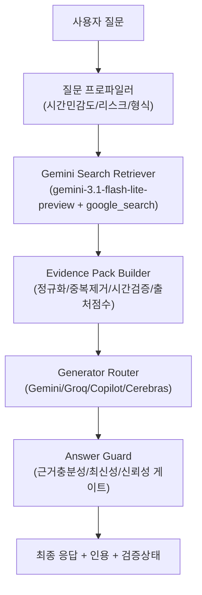

# Gemini 검색 전용 리트리버 + 멀티 LLM 생성기 통합 설계서

업데이트 기준: 2026-03-13

현재 구현 참고:

- 현행 검색 경로는 `GeminiGroundedRetriever + SearchEvidencePackBuilder + SearchAnswerGuard + DefaultSearchAnswerComposer` 조합을 기준으로 운영한다.
- 이 문서는 제품 설계/확장 기준 문서이며, 실제 현재 계약은 `apps/omninode-middleware/src/CommandService.SearchPipeline.cs`와 관련 타입이 가장 정확하다.

## 1) 문서 목적
현재 루프에서 사용 중인 기존 검색 방안을 유지한 채 개발을 진행하되, 루프 종료 후 패치로 적용할 차세대 구조를 정의한다.

핵심 목표는 다음 3가지다.

1. 웹 검색/최신 정보 수집은 `gemini-3.1-flash-lite-preview` + `google_search grounding`으로 일원화
2. 최종 답변 생성은 기존 멀티 제공자(`Gemini/Groq/Copilot/Cerebras`)를 그대로 사용
3. 최신성/신뢰성 미달 시 단정 답변을 차단하는 `fail-closed` 출력 게이트 강제

## 1.1) 공식 참고 링크(필수)
본 설계의 검색 리트리버 모델/도구 기준 문서다.

1. [Gemini 3.1 Flash-Lite Preview 모델 문서](https://ai.google.dev/gemini-api/docs/models/gemini-3.1-flash-lite-preview?hl=ko)
2. [Google Search 그라운딩 문서](https://ai.google.dev/gemini-api/docs/google-search?hl=ko)

## 1.2) Gemini 3.1 Flash-Lite Preview 핵심 스펙(2026-03 확인 기준)
아래 항목은 공식 문서 기준 운영 시 주의해야 할 실무 포인트다.

1. 모델 ID: `gemini-3.1-flash-lite-preview`
2. 입력 지원: 텍스트/이미지/동영상/오디오/PDF
3. 출력 지원: 텍스트
4. 토큰 한도: 입력 `1,048,576`, 출력 `65,536`
5. 검색 그라운딩: 지원됨
6. 지원 기능: Batch API, 캐싱, 코드 실행, 파일 검색, 함수 호출, 구조화된 출력, 사고, URL 컨텍스트
7. 미지원 기능: 오디오 생성, 컴퓨터 사용, Google 지도 그라운딩, 이미지 생성, Live API
8. 문서 표기 기준 정보: 최신 업데이트 `2026년 3월`, 지식 단절 `2025년 1월`

## 1.3) 모델 채택 이유(검색 전용 리트리버 관점)
공식 설명 기준으로 Flash-Lite는 저지연/저비용 대량 처리에 최적화되어 있어, 검색-수집-정규화 단계 전용 모델로 적합하다.  
최종 문장 품질/스타일링은 기존 Generator(타 LLM)로 분리해 운영한다.

## 2) 핵심 원칙
기존 외부 검색 경로 대체를 단순 교체가 아닌, 역할 분리 아키텍처로 구현한다.

1. `Retriever(검색 전용)`와 `Generator(답변 전용)`를 분리
2. Generator는 웹검색을 직접 하지 않고, Retriever가 만든 근거 묶음만 사용
3. 근거 부족이면 답변을 줄이거나 보류하고, 억지로 항목 수를 채우지 않음

## 3) 적용 범위
아래 모든 실제 요청 경로에 공통 적용한다.

1. 대화탭 단일/오케스트레이션/다중 LLM
2. 코딩탭 단일/오케스트레이션/다중 코딩
3. 텔레그램 봇 대화 경로

## 4) 목표 아키텍처



## 5) 데이터 계약(Evidence Pack)
Retriever가 생성기에 넘기는 표준 포맷이다. 생성기는 이 구조만 보고 답한다.

```json
{
  "query": "오늘 주요 뉴스 5건 말해",
  "requestedAtUtc": "2026-03-04T03:10:00Z",
  "userLocale": "ko-KR",
  "userTimezone": "Asia/Seoul",
  "intentProfile": {
    "timeSensitivity": "high",
    "riskLevel": "normal",
    "answerType": "list"
  },
  "constraints": {
    "maxAgeHours": 24,
    "minIndependentSources": 2,
    "targetCount": 5,
    "strictTodayWindow": true
  },
  "items": [
    {
      "citationId": "c1",
      "title": "예시 기사 제목",
      "url": "https://example.com/news/abc",
      "domain": "example.com",
      "publishedAt": "2026-03-04T01:20:00+09:00",
      "retrievedAtUtc": "2026-03-04T03:10:12Z",
      "snippet": "핵심 요약",
      "sourceType": "news",
      "isPrimarySource": false,
      "freshnessScore": 0.91,
      "credibilityScore": 0.77,
      "duplicateClusterId": "cluster-12"
    }
  ],
  "claims": [
    {
      "claimId": "k1",
      "text": "핵심 사실 주장 문장",
      "supportedBy": ["c1", "c3"],
      "conflictWith": []
    }
  ],
  "quality": {
    "freshnessPass": true,
    "credibilityPass": true,
    "coveragePass": false,
    "coverageReason": "요청 5건 중 검증 통과 3건만 확보"
  }
}
```

## 6) 검색/검증 파이프라인 상세

### 6.1 질문 프로파일링(주제 하드코딩 금지)
질문 카테고리를 세분화하지 않고, 아래 축만 계산한다.

1. `timeSensitivity`: high/medium/low
2. `riskLevel`: high/normal
3. `answerType`: short/list/explain/code/compare

### 6.2 검색 수행
Retriever는 Gemini Search를 사용해 후보 문서를 수집한다.

1. 1차 검색: 원 질의 그대로
2. 2차 검색: 질의 재작성(동의어, 최근성 강조)
3. 3차 검색: 부족 항목 보강용(단, 제약 유지)
4. 기본 과수집(oversampling): `K = max(2N, 10)`  
`N`은 사용자 요청 건수이며, 후보는 최소 2배부터 수집한다.
5. 고노이즈 질의 과수집: `K = max(3N, 15)`  
예: `오늘 주요 뉴스`, `실시간 이슈`, `핫토픽` 등 혼합 잡음이 많은 질의
6. 열거형 질의(예: `gemini 버전 다 말해`)는 `N` 고정이 아니라 `전체 열거 모드`로 동작하며, 공식 소스 페이지네이션 종료까지 수집한다

### 6.3 정규화/중복 제거

1. URL canonicalization
2. 동일 이벤트 기사 클러스터링
3. 재배포/미러 문서 제거

### 6.4 최신성 판정

1. `publishedAt` 없는 문서는 기본 폐기(엄격 모드)
2. timeSensitivity가 high면 시간창 엄격 적용(예: 24시간 또는 질문 기반)
3. 질문이 `오늘`이면 사용자 타임존 기준 날짜창 강제

### 6.5 신뢰성 판정

1. 도메인 기본 점수(전역 테이블)
2. 1차 출처 링크/공식 발표문 가점
3. 독립 출처 최소 개수 미달 시 coverage fail
4. 상충 claim 탐지 시 단정 금지

### 6.6 출력 게이트(fail-closed)

1. `freshnessPass && credibilityPass`가 아니면 확정형 답변 금지
2. 기본 모드는 `N=요청 건수` 강제 충족(`count-lock`)으로 동작
3. 단, `최소 신뢰 바닥선(trust floor)` 미만 항목은 최종 출력 금지
4. N 미충족 시 부분 응답으로 종료하지 않고 재수집/보강 루프로 이동

### 6.7 건수 강제 충족 정책(`count-lock`)
요청 건수와 출력 건수를 동일하게 맞추기 위한 보강 규칙이다.

1. 출력 슬롯은 요청 시점에 고정한다  
예: `오늘 주요 뉴스 5건` => 슬롯 5개 고정
2. 1차 후보는 최소 `2N`(고노이즈 `3N`)으로 수집한다
3. 후보 부족 시 아래 순서로 보강한다  
`질의 재작성 -> 소스 확장 -> 페이지 확장 -> 추가 과수집(K += N) -> 시간창 미세 완화(정책 허용 범위 내)`
4. 열거형 질의는 `전체 열거 모드`로 전환하고, 공식 목록 소스에서 누락이 없을 때까지 수집한다
5. 보강 과정에서도 trust floor는 유지한다
6. N건 충족 전에는 생성 단계로 넘기지 않는다
7. 최대 반복 횟수 초과 시 `응답 실패`로 처리하며, 기본값은 부분 성공 반환이 아니라 재시도 트리거다

### 6.8 `publishedAt` 누락 문서로 인한 count-lock 미충족 보강 정책
`publishedAt` 없는 문서를 엄격 모드에서 폐기할 때, count-lock 미충족이 발생하는 경우의 운영 기준이다.

1. 기본 원칙  
`publishedAt` 누락 문서는 최신성 검증 불가로 간주해 기본 폐기한다(`fail-closed` 유지).
2. 보강 재수집 순서  
`질의 재작성(발행시각 포함 강제) -> 소스 확장 -> 페이지 확장 -> 추가 과수집(K += N) -> 시간창 미세 완화(StrictTodayWindow=false인 경우만)` 순으로 재수집한다.
3. 완화 상한  
시간창 미세 완화는 정책 상한(기본 최대 +24시간) 안에서만 허용한다. `StrictTodayWindow=true` 질의에서는 시간창 완화를 금지한다.
4. 실패 종료 조건  
최대 반복 횟수 내에도 N건을 채우지 못하면 부분 응답으로 강행하지 않고 `count_lock_unsatisfied_after_retries`로 종료한다.
5. 근거 로그 필수 항목  
운영 로그에 `dropReasons.publishedAtMissing`, `retryCount`, `countLockReasonCode`, `finalK`, `timeWindowRelaxed`를 남긴다.

## 7) 생성기(타 LLM) 프롬프트 규칙
Generator는 Evidence Pack 밖의 사실을 단정하면 안 된다.

1. 근거 없는 사실 추가 금지
2. 각 문장에 citationId 매핑
3. 미검증 영역은 “확인 불가” 명시
4. 코딩 질문에서는 검색 근거 + 코드 맥락을 분리해 출력

예시 시스템 규칙(요약):

```text
너는 Evidence Pack 기반 답변기다.
- 팩 외부 사실을 단정하지 마라.
- 각 핵심 주장에 citationId를 붙여라.
- coveragePass=false면 개수를 억지로 채우지 마라.
```

## 8) 예시 시나리오

### 8.1 예시 A: "오늘 주요 뉴스 5건 말해"
기대 동작:

1. 타임존 `Asia/Seoul` 기준 오늘 범위를 계산
2. 뉴스 형식 문서만 허용, 칼럼/사전성 글 제외
3. 검증 통과 후보가 부족하면 재수집/보강을 수행하여 5개 슬롯을 채운 뒤 반환
4. 각 항목에 출처/게시시각/검증등급을 표시

금지 동작:

1. 오늘 주요 뉴스가 아닌 기사 포함
2. 지역 로컬 뉴스 무관 포함
3. “뉴스” 키워드가 포함된 다른 검색/문서로 수량 채우기

### 8.2 예시 B: "React 20에서 Server Actions 변경점 알려줘"
기대 동작:

1. 최신 공식 문서/릴리스 노트 우선
2. 블로그 단일 출처 단정 금지
3. 버전/날짜/링크 동시 제시

### 8.3 예시 C: "오늘 삼성전자 주가 요약"
기대 동작:

1. 시간 민감 high + 재무 리스크 high
2. 시세/뉴스 분리 제시
3. 데이터 시각(quote time) 명시, 투자 자문 단정 회피

### 8.4 예시 D: "gemini 버전 다 말해"
기대 동작:

1. 웹 검색 집계가 아니라 공식 모델 목록 소스(API/공식 문서) 우선 조회
2. 열거 질의는 `전체 목록 모드`로 처리하여 누락 최소화
3. 응답에 `기준 시각(collectedAt)`을 명시해 시점 기반 전체 목록임을 표시
4. 비공식/중복 이름은 정규화하여 별칭으로 분리 표기
5. 검색 후보는 최소 `2N` 개념이 아니라, 공식 목록의 끝을 확인할 때까지 페이지 단위로 순회

## 9) Omni-node 구현 포인트(패치 대상)

### 9.1 신규/변경 컴포넌트

1. `SearchGateway` 인터페이스
2. `GeminiGroundedRetriever` 구현체
3. `EvidencePackBuilder`
4. `AnswerGuard`(최신성/신뢰성/커버리지 게이트)
5. `ProviderAgnosticGeneratorAdapter`

### 9.2 설정 항목

1. `EnableGeminiGroundedSearch=true|false`
2. `RetrieverModel=gemini-3.1-flash-lite-preview`
3. `StrictFreshnessMode=true`
4. `FailClosedMode=true`
5. `MinIndependentSources`, `DefaultMaxAgeHours`

### 9.3 기존 루프와의 관계

1. 현재 루프는 기존 검색 방안으로 진행
2. 루프 종료 후 본 문서 기준으로 패치 브랜치에서 순차 적용
3. 대규모 일괄 교체가 아니라 어댑터 추가 후 라우팅 전환 방식으로 롤아웃

## 10) 단계별 패치 계획(루프 종료 후)

1. `Phase A`  
Retriever/Generator 분리 인터페이스 도입, 기존 경로와 공존
2. `Phase B`  
Gemini Grounded Retriever 추가, Feature Flag 뒤에 연결
3. `Phase C`  
Evidence Pack/Answer Guard 적용, 대화탭부터 점진 전환
4. `Phase D`  
코딩탭/텔레그램 동일 파이프라인 확장
5. `Phase E`  
관측성(로그/메트릭) 추가 후 기본값 전환

## 11) 수용 기준(Acceptance Criteria)

### 11.1 기능 기준

1. 대화/코딩/텔레그램 모두 동일 Retriever 파이프라인 사용
2. 생성 모델 변경(Groq/Copilot/Cerebras) 시에도 근거 기반 출력 유지
3. 근거 부족 시 단정 답변 차단

### 11.2 품질 기준

1. `오늘 뉴스 N건` 요청에서 최종 출력 건수 = 요청 건수(`N=N`)
2. `오늘 뉴스 N건` 요청에서 시간창 외 문서 0건
3. 중복 이벤트 다건 노출률 임계치 이하
4. 인용 누락률 임계치 이하

### 11.3 회귀 기준

1. 단일 모델/오케스트레이션/다중 경로 회귀 통과
2. 텔레그램 실봇 미검증 상황에서는 우회 시뮬레이션 회귀 강제
3. 실패 케이스에서 fail-closed 메시지 일관성 보장

## 12) 운영 가이드

1. 기본 정책은 부분 응답이 아니라 `count-lock` 충족이다(부족 시 재수집)
2. 의학/법/금융은 기본 엄격 모드
3. 로그에는 최소한 아래를 남긴다  
`query`, `timeWindow`, `retrievedCount`, `validatedCount`, `dropReasons`, `modelRoute`
4. 추가로 아래를 남긴다  
`targetCount`, `initialK`, `finalK`, `retryCount`, `countLockSatisfied`
5. `publishedAt` 누락 폐기 관측을 위해 아래를 추가로 남긴다  
`dropReasons.publishedAtMissing`, `countLockReasonCode`, `timeWindowRelaxed`

## 13) 리스크와 완화

1. 리스크: Gemini 검색 응답 변동  
완화: 재시도 정책 + 캐시 + 결과 정규화
2. 리스크: 생성 모델 환각  
완화: Evidence Pack 외부 단정 금지 규칙 + 게이트
3. 리스크: 호출 비용 증가  
완화: `2N/3N` 과수집을 기본값으로 두되, 캐시 TTL/질의 재사용/최대 반복 횟수 상한으로 비용 통제

## 14) 롤백 전략

1. Feature Flag로 즉시 기존 검색 경로 복귀
2. Retriever만 롤백하고 Generator는 유지 가능하게 분리
3. 장애 시 `fail-closed` 기본 응답으로 안전 종료

## 15) 구현 체크리스트

1. SearchGateway 인터페이스 반영
2. Gemini Grounded Retriever 연결
3. Evidence Pack 스키마 고정
4. Answer Guard 적용
5. 대화/코딩/텔레그램 라우팅 일치
6. 로그/메트릭/에러코드 표준화
7. 회귀 시나리오 문서화 및 자동 루프 반영

## 16) 결론
이 설계는 “검색은 Gemini로 통일, 생성은 멀티 LLM 유지”라는 요구를 충족한다.  
동시에 최신성/신뢰성을 점수 놀이가 아닌 강제 게이트로 다루기 때문에, 실제 체감 품질 하락(오래된 뉴스/무관 문서/허위 단정)을 구조적으로 줄일 수 있다.
