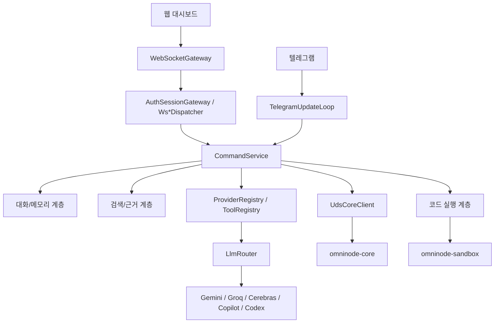
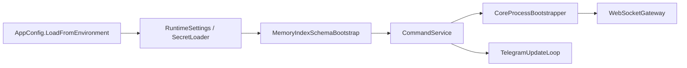
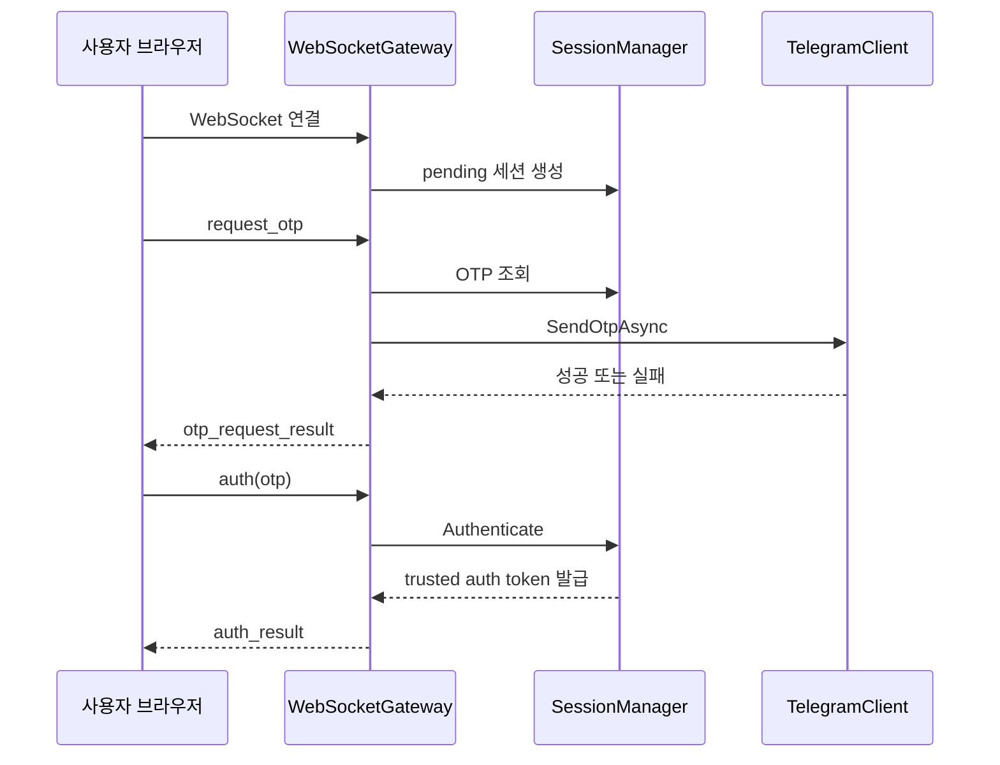
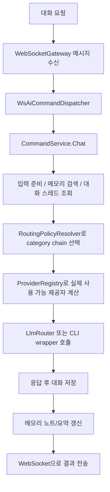
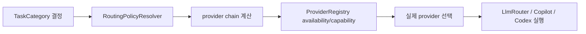
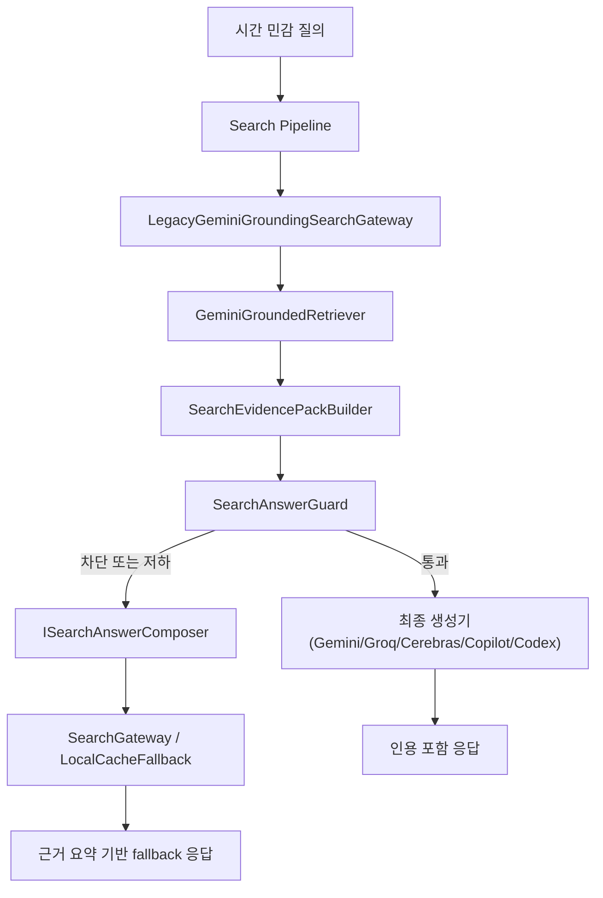
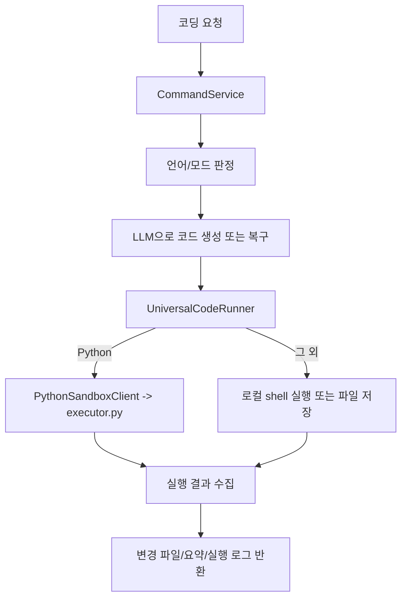
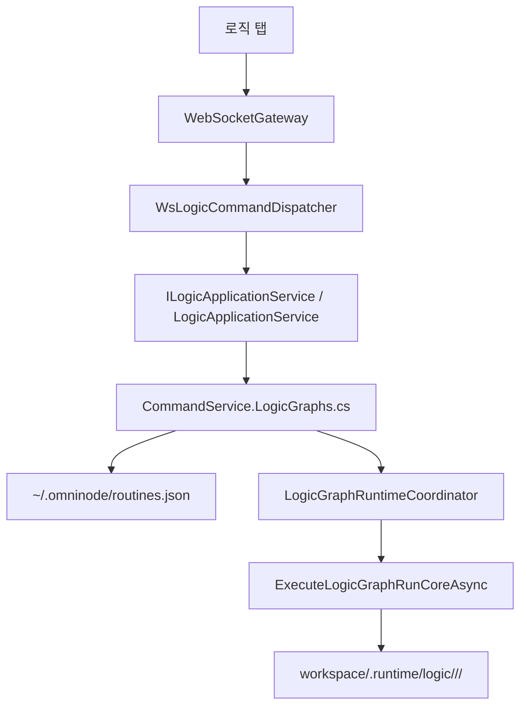
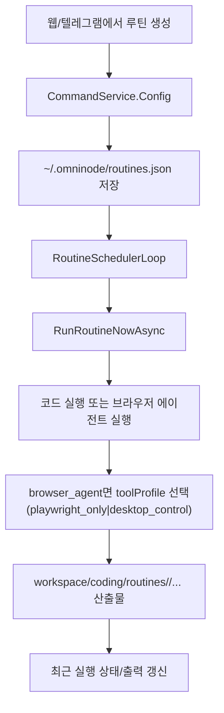
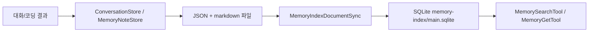

# Omni-node 아키텍처 흐름

업데이트 기준: 2026-03-12

이 문서는 저장소를 “어떤 파일이 있느냐”가 아니라 “요청이 들어왔을 때 실제로 어떻게 흐르느냐” 기준으로 정리합니다.

## 1. 전체 런타임 흐름



핵심 실행은 여전히 단일 프로세스 안에서 이뤄지지만, 전송 계층은 `AuthSessionGateway`, `Ws*CommandDispatcher`, 정적/API endpoint로 먼저 나뉜 뒤 `CommandService` partial 계층으로 들어갑니다.

## 2. 시작 시퀀스

`Program.cs` 기준 부팅 순서는 아래와 같습니다.

1. 환경변수와 시크릿 로드
2. `RuntimeSettings`, `TelegramClient`, `SessionManager`, `UdsCoreClient` 생성
3. `LlmRouter`, `GroqModelCatalog`, `CodexCliWrapper`, `CopilotCliWrapper` 준비
4. 대화 저장소, 메모리 저장소, 루틴/산출물 저장소, 코드 실행기, 툴 레지스트리 구성
5. 메모리 인덱스 bootstrap + 1회 sync
6. 검색 계약과 fallback composer 구성
7. `CommandService` 생성 후 `LogicGraphRuntimeCoordinator` 연결
8. `CoreProcessBootstrapper`로 core socket 응답 확인 및 필요 시 `omninode_core` 자동 부트스트랩
9. `WebSocketGateway`와 `TelegramUpdateLoop` 시작



## 3. 인증 흐름

대시보드는 WebSocket 세션과 OTP를 사용합니다.



보조 포인트:

- 텔레그램 미설정 시 로컬 OTP fallback 가능
- trusted auth token은 서명되고 일 단위 키 로테이션을 사용
- 브라우저는 이후 `resume_auth`로 세션 복구 가능

## 4. 일반 대화 흐름



기본 chain 예시는 아래와 같습니다.

```text
generalChat: gemini -> groq -> cerebras -> copilot -> codex
planner: gemini -> groq -> cerebras -> codex -> copilot
reviewer: codex -> gemini -> groq -> cerebras -> copilot
deepCode: codex -> copilot -> gemini -> groq -> cerebras
searchTimeSensitive: gemini -> groq -> cerebras -> codex -> copilot
```

즉, "어떤 제공자가 먼저냐"보다 "지금 무슨 종류의 일을 하느냐"가 먼저 결정되고, 그 안에서 fallback이 적용됩니다.

대화 탭 모드별 핵심 차이는 아래와 같습니다.

- `단일`: 선택한 provider/model 하나로 바로 답변
- `단일`에서 입력에 URL이 있으면 Gemini URL 컨텍스트 경로를 먼저 확인하고, 링크만 던진 입력도 `이 링크 설명/요약` 요청으로 보정해서 페이지/문서/저장소 소개 응답을 우선 생성
- GitHub 저장소 루트 링크는 URL 도구에만 맡기지 않고 공개 README를 직접 읽은 보조 컨텍스트를 함께 넣어, 특정 키워드 질문일 때 저장소 본문에 있는 내용만 우선 답하게 함
- `오케스트레이션`: 워커 모델들에게 같은 질문을 그대로 복제하지 않고, 요청 성격에 따라 `초안 / 리스크 점검 / 반례·예외 / 실행안 구체화 / 최종 누락 점검` 역할을 자동 분담한 뒤 집계 모델이 통합
- `다중`: provider별 원답을 모두 보존하고, UI에서는 모델 캐러셀과 별도 `공통 요약 / 공통 핵심 / 부분 차이` 정리로 나눠 표시

## 4.1 category 라우팅 개요



대표 매핑:

- 일반 채팅: `generalChat`
- 계획 생성: `planner`
- 계획 리뷰: `reviewer`
- 최신성 판단/검색 라우팅: `searchTimeSensitive`, `searchFallback`
- 대형 코딩: `deepCode`
- 안전 리팩터: `safeRefactor`
- UI 작업: `visualUi`
- 문서화: `documentation`

## 5. 최신정보/검색 응답 흐름

현재 최신정보 경로의 문서상 기준 추상화는 특정 gateway가 아니라, Gemini grounding과 evidence/cache fallback을 함께 묶는 검색 파이프라인입니다.



세부 규칙:

- 문서에서 말하는 검색의 주인공은 `LegacyGeminiGroundingSearchGateway` 단일 객체가 아니라 `gateway + retriever + guard + composer`로 구성된 검색 파이프라인입니다
- `GeminiGroundedRetriever`는 그 파이프라인 안에서 `google_search` 툴을 붙여 근거를 수집하는 primary retriever입니다
- 외부 웹 본문은 `EXTERNAL_UNTRUSTED_CONTENT` 경계로 감쌈
- `SearchAnswerGuard`는 파이프라인의 guard 단계에서 `coverage`, `freshness`, `credibility`를 평가합니다
- count-lock 미충족이면 최종 답변 대신 차단 또는 부분 fallback 응답으로 전환될 수 있음
- `SearchRetrieverPath.LocalCacheFallback`은 최근 확보한 검증 스냅샷을 근거로 사용하는 파이프라인의 대체 retriever 경로입니다

## 6. 코딩 실행 흐름



특징:

- HTML/CSS는 실행 대신 파일 저장
- Python은 별도 샌드박스 경로 사용
- `단일 코딩`: 모델 1개가 같은 실행 폴더에서 구현, 실행, 검증, 수정까지 끝까지 수행
- `오케스트레이션 코딩`: `기획 -> 개발 -> 검증 및 테스트 -> 수정` 단계를 모델들이 분담하고 같은 실행 폴더를 이어서 사용
- `다중 코딩`: 선택한 각 모델이 실행별 루트 아래 자기 전용 하위 폴더에서 독립 완주하고, 별도 비교 요약 모델이 `공통 요약 / 공통점 / 차이 / 추천`만 정리
- `단일 / 오케스트레이션 / 다중` 모두 같은 루트 `workspace/coding/runs/` 아래에 실행별 폴더를 만듦
- 코딩 탭 생성 파일은 `workspace/coding/runs/<실행별 폴더>/` 아래에 쌓임
- 다중 코딩은 `workspace/coding/runs/<실행별 폴더>/<provider>-<model>/` 구조로 모델별 결과를 분리 저장
- 실행 루프는 모델이 생성한 `path`와 `run command`의 개행/탭을 정규화해 그대로 파일명이나 대기형 셸 명령으로 흘러가지 않게 막고, 요청에 명시된 파일명이 있으면 그 경로를 우선 선택함
- 요청이나 모델 응답에 절대경로, 스마트 따옴표, 예전 `workspace/coding/...` 접두 경로가 섞여 있어도 현재 실행 폴더 기준 상대 경로로 재정리해 run 폴더 안에서만 작업을 이어감
- 최종 검증은 요청에 출력값이 있으면 stdout까지 함께 확인하고, 실패하면 같은 실행 폴더에서 오류 stderr를 포함한 1회 추가 수정 패스를 돌린 뒤 다시 검증함
- 단일 파일 요청에서 남은 기본 엔트리 파일은 성공 시 정리함
- Copilot 단일 코딩에서 `파일 하나 + 특정 문자열 출력` 형태의 단순 smoke 요청은 원본 사용자 입력 기준 fast-path를 먼저 적용해 바로 파일 생성과 stdout 검증을 끝냄
- 최근 코딩 결과 요약/실행 메타는 `conversations.json`에 대화별 snapshot으로 저장되어 `conversation_detail` 응답 때 복원됨
- 최근 코딩 결과 `실행`은 마지막 검증 커맨드를 그대로 재사용하지 않고, 엔트리 파일 실행을 우선 선택해 stdout/stderr와 프리뷰를 다시 수집함
- 텔레그램은 같은 코딩 파이프라인을 `/coding` 계열과 자연어 제어 양쪽으로 재사용하며, 코딩 모드/언어/제공자/모델/워커 설정도 텔레그램 쪽 별도 preference로 유지함

## 6.1 로직 그래프 실행 흐름

로직 그래프는 루틴 저장소를 재사용하지만, `TaskGraph`와 별개인 전용 직접 실행 경로를 가진다. 현재 편집과 실행 시작점은 웹 대시보드 `로직 탭`이다.



핵심 포인트:

- 저장 모델은 일반 루틴과 같은 `~/.omninode/routines.json`이지만, `ExecutionMode=logic_graph`와 `LogicGraph` 본문을 함께 저장한다
- `get_routines` 경로는 `logic_graph` 항목을 필터링하므로, 일반 루틴 탭 목록과 로직 탭 목록이 섞이지 않는다
- WebSocket 명령은 `logic_graph_list`, `logic_graph_get`, `logic_graph_save`, `logic_graph_delete`, `logic_graph_run`, `logic_graph_cancel`, `logic_graph_run_get`으로 분리된다
- 실행 전 검증은 `logic.graph.v1` 버전 확인, `start` 정확히 1개, `end` 1개 이상, 끊긴 edge 금지, 포트 타입 일치, `parallel_join` 선행 2개 이상, DAG 순환 금지를 본다
- 실행 산출물은 실행별 디렉터리에 `graph.json`, `snapshot.json`, `events.log`로 남는다
- 대화/코딩 계열 노드는 기존 탭 이력을 재사용하지 않고 노드 실행별 분리 세션이나 대화를 만들어 `conversationId` 또는 `sessionKey`를 결과 envelope에 남긴다
- 노드 공통 결과는 `LogicNodeResultEnvelope`로 정리되고, `ok`, `text`, `data`, `artifacts`, `conversationId`, `sessionKey`, `links`를 포함한다

## 7. 루틴/스케줄러 흐름

루틴은 대시보드와 텔레그램 양쪽에서 관리할 수 있습니다.



현재 구조상 루틴은 두 층을 함께 사용합니다.

- 상태 저장: `~/.omninode/routines.json`
- 작업 산출물: `workspace/coding/routines/`
- 로직 그래프도 같은 상태 파일을 쓰지만, 작업 산출물은 `workspace/.runtime/logic/` 아래 별도 디렉터리를 사용하고 일반 루틴 탭 목록에는 나타나지 않음
- 브라우저 에이전트 루틴은 `AgentToolProfile`을 상태에 저장하며, 현재 `playwright_only`, `desktop_control` 두 값을 지원함
- 루틴 정의에는 `NotifyTelegram` on/off 상태도 같이 저장되며, 기본값은 `true`다
- `desktop_control`은 macOS에서만 실제 실행되며, Playwright로 부족할 때만 repo-local desktop MCP를 추가로 연결함
- 브라우저 에이전트의 스크린샷/다운로드 산출물은 `workspace/coding/routines/<routine-id>/assets/<runTs>/` 아래에 저장되고, 실행 이력 detail/summary에도 같은 절대경로가 함께 남음
- 웹에서 수동 실행한 루틴은 source가 `web`라서 텔레그램 전송을 시도하지 않고 `telegramStatus=not_applicable`로 남음
- 예약 실행은 `NotifyTelegram=true`인 루틴만 텔레그램 전송을 시도하며, 결과가 `sent`/`failed` 등으로 남음
- `telegram_test`, `telegram_resend` 같은 명시적 전송은 `NotifyTelegram=false`여도 계속 허용함
- 텔레그램에서는 `/routine update`, `/routine runs`, `/routine detail`, `/routine resend`와 자연어 동의어가 같은 루틴 명령층으로 합류함

## 8. 메모리/대화 저장 흐름



즉, 메모리는 단순 파일 저장과 검색용 인덱스를 동시에 유지하는 구조입니다. 이때 `conversations.json`에는 일반 메시지뿐 아니라 대화별 최근 코딩 결과 snapshot도 함께 들어갑니다.

## 9. 운영 관점에서 꼭 알아둘 흐름

- 프런트엔드는 정적 파일이라 미들웨어만 뜨면 같이 열립니다.
- 텔레그램 미설정 상태에서도 웹 대시보드는 단독으로 테스트 가능합니다.
- 텔레그램 polling은 offset 파일과 단일 인스턴스 lock으로 중복 응답을 막습니다.
- 검색 품질 문제는 보통 `Retriever -> Evidence Pack -> Guard -> Composer fallback` 구간에서 추적해야 합니다.
- 루틴은 단순 cron 문자열 저장이 아니라 실행 코드, 실행 이력, 재시도 정책, 알림 정책까지 함께 관리합니다.
- 로직 그래프는 루틴 저장소를 공유하지만 실행 흔적과 UI는 별도 계층이므로, 문제 추적 시 `routines.json`과 `workspace/.runtime/logic/`를 같이 봐야 합니다.
