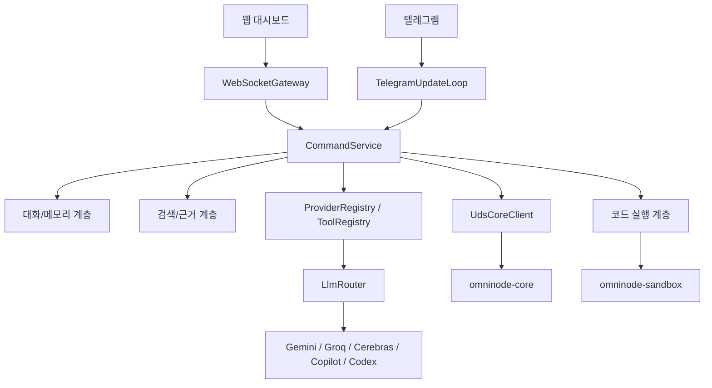
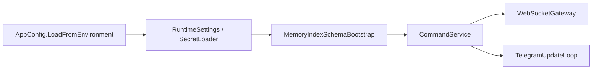
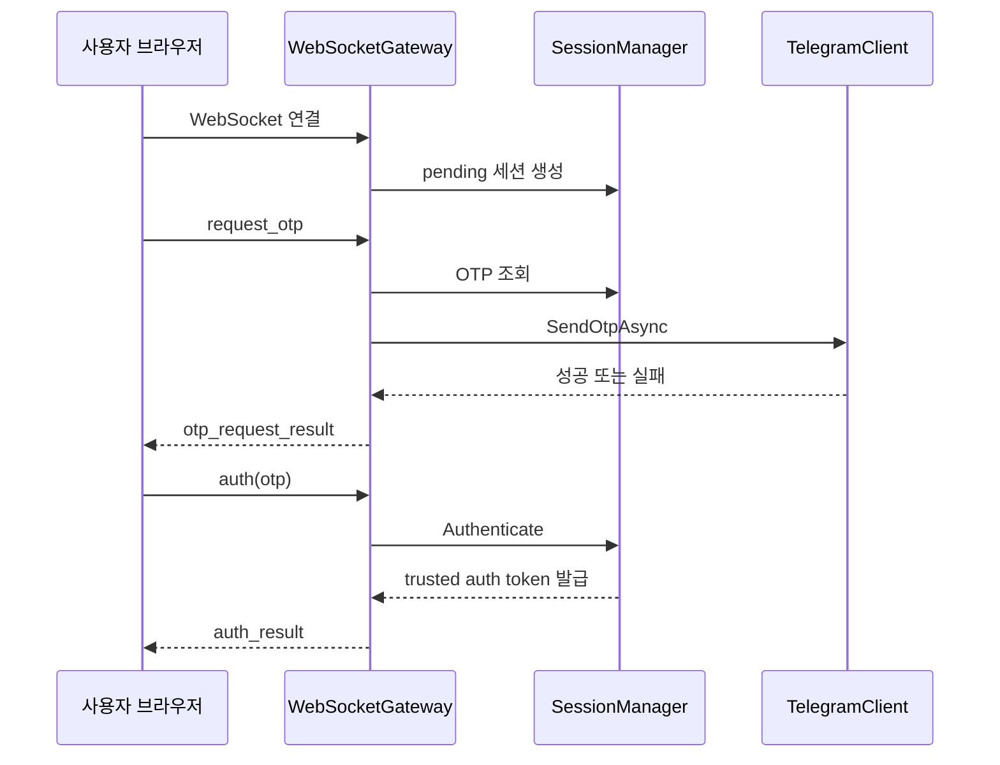
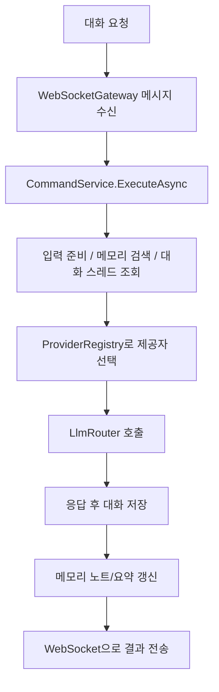
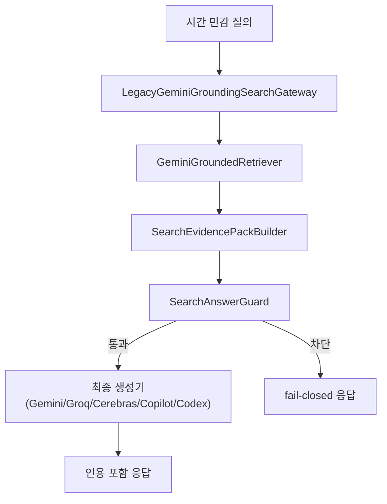
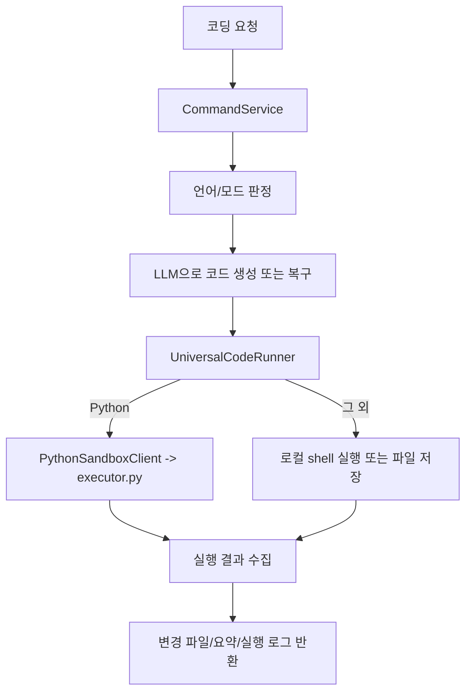
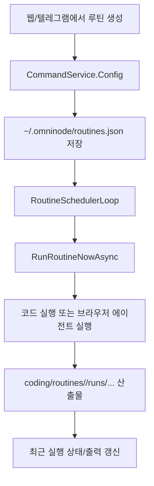
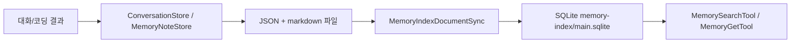

# Omni-node 아키텍처 흐름

업데이트 기준: 2026-03-07

이 문서는 저장소를 “어떤 파일이 있느냐”가 아니라 “요청이 들어왔을 때 실제로 어떻게 흐르느냐” 기준으로 정리합니다.

## 1. 전체 런타임 흐름



핵심은 `CommandService`가 거의 모든 기능의 허브라는 점입니다.

## 2. 시작 시퀀스

`Program.cs` 기준 부팅 순서는 아래와 같습니다.

1. 환경변수와 시크릿 로드
2. `RuntimeSettings`, `TelegramClient`, `SessionManager`, `UdsCoreClient` 생성
3. `LlmRouter`, `GroqModelCatalog`, `CodexCliWrapper`, `CopilotCliWrapper` 준비
4. 대화 저장소, 메모리 저장소, 코드 실행기, 툴 레지스트리 구성
5. 메모리 인덱스 bootstrap + 1회 sync
6. `CommandService` 생성
7. `WebSocketGateway`와 `TelegramUpdateLoop` 시작



## 3. 인증 흐름

대시보드는 WebSocket 세션과 OTP를 사용합니다.



보조 포인트:

- 텔레그램 미설정 시 로컬 OTP fallback 가능
- trusted auth token은 서명되고 일 단위 키 로테이션을 사용
- 브라우저는 이후 `resume_auth`로 세션 복구 가능

## 4. 일반 대화 흐름



자동 제공자 선택 시 우선순위는 다음과 같습니다.

```text
gemini -> groq -> cerebras -> copilot -> codex
```

## 5. 최신정보/검색 응답 흐름

현재 최신정보 경로는 Gemini grounding 단일 검색 파이프라인을 중심으로 돌아갑니다.



세부 규칙:

- `GeminiGroundedRetriever`는 `google_search` 툴을 붙여 근거를 수집
- 외부 웹 본문은 `EXTERNAL_UNTRUSTED_CONTENT` 경계로 감쌈
- `SearchAnswerGuard`는 `coverage`, `freshness`, `credibility`를 평가
- count-lock 미충족이면 최종 답변 대신 차단 가능

## 6. 코딩 실행 흐름



특징:

- HTML/CSS는 실행 대신 파일 저장
- Python은 별도 샌드박스 경로 사용
- 실행 산출물은 날짜 기준 디렉터리에 쌓임

## 7. 루틴/스케줄러 흐름

루틴은 대시보드와 텔레그램 양쪽에서 관리할 수 있습니다.



현재 구조상 루틴은 두 층을 함께 사용합니다.

- 상태 저장: `~/.omninode/routines.json`
- 작업 산출물: `coding/routines/`

## 8. 메모리/대화 저장 흐름



즉, 메모리는 단순 파일 저장과 검색용 인덱스를 동시에 유지하는 구조입니다.

## 9. 운영 관점에서 꼭 알아둘 흐름

- 프런트엔드는 정적 파일이라 미들웨어만 뜨면 같이 열립니다.
- 텔레그램 미설정 상태에서도 웹 대시보드는 단독으로 테스트 가능합니다.
- 검색 품질 문제는 보통 생성기보다 `Retriever -> Evidence Pack -> Guard` 구간에서 추적해야 합니다.
- 루틴은 단순 cron 문자열 저장이 아니라 실행 코드, 실행 이력, 재시도 정책, 알림 정책까지 함께 관리합니다.
